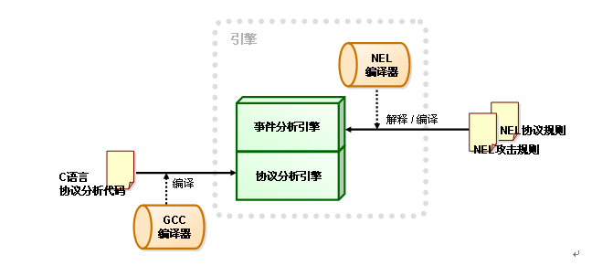
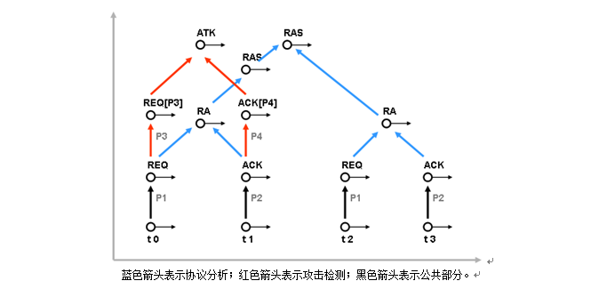

## Network Event Language (NEL)

Network Event Language（以下简称NEL）是一种通用网络攻击描述语言，是为了解决大型攻击检测防御系统开发过程中所面临的难题而提出的。通常攻击检测防御系统采用两种模式来进行开发：

-  全部使用通用高级语言（比如C）来实现协议分析和攻击检测。这种开发模式的问题在于，每当新的攻击出现，开发者增加相应的规则后就需要重新编译系统，而且需要开发人员对于攻击有深入的了解，系统的可扩展性和可维护性都比较差。对于大型的攻击检测防御系统来说，这种开发模式基本上是不可行的。

-  使用专用的攻击描述语言进行开发。为了解决第一种模式存在的问题，很多IDS/IPS厂商以及研究机构提出了一些攻击描述语言，比如SourceFire公司的SNORT语言、NFR的N-Code语言、V. Paxson 提出的Bro语言等。采用这些语言开发的系统，在增加新的规则后无须重新编译系统，从而大大缩短了攻击应对的时间。但这些语言都将协议分析固化到语言本身当中，当需要增加一个新的协议防护模块时，就必须对语言本身进行扩充。由于大型攻击检测防御系统往往需要几十人、甚至是上百人开发并维护数百种协议防护模块，数千条攻击检测防御规则，要求每个开发人员都具有扩充语言平台的能力是不可能的。这种限制使得基于上述语言平台开发的攻击检测防御产品的功能扩展性受到了极大的制约。

NEL平台有效解决了上述两种开发模式所面临的难题。基于NEL平台，可以将基于协议分析的攻击检测防御任务划分为：协议分析的开发，攻击检测防御规则的开发和语言平台的开发这三个子任务，每个子任务分别由协议分析小组、攻击分析小组、攻击描述语言开发小组来承担。这样，即使系统增加了很多的协议、制订了很多条攻击检测防御规则、描述语言的语法不断增强，每个子系统的扩展以及规模的不断增长不会影响到其他开发小组中的开发人员，极大地提升了大规模攻击检测防御系统的开发效率。

采用NEL平台不仅解决了分层次开发和系统扩展性的难题，而且由于NEL在运行期将"协议分析"和"攻击检测"紧密耦合在一起，因此开发出的系统具有非常高的运行效率。NEL平台全新开发模式以及在代码执行速度等方面的诸多技术优势使得它成为一个理想的高性能攻击检测防御产品的开发平台。

## 基于NEL的开发方法学 

下图概要地介绍了使用NEL生成攻击检测引擎的开发过程，一个基本的攻击检测引擎将包含"协议分析引擎"和"事件分析引擎"两部分，前者使用传统编译器（如GCC）编译而成，后者使用NEL编译器生成，和GCC这种独立编译器不同，NEL编译器是一个内置的编译器，它在运行期读入NEL协议规则和NEL攻击规则文件进行语法分析，在内存中生成事件分析引擎，并最终构成一个攻击检测引擎实体。

事件分析引擎不仅可以使用NEL定义的语言成分，也可以无缝地使用协议分析引擎中的C语言常量、变量、结构、函数等语言实体，从而可以复用大量己有的C程序代码，有效缩短产品的面世时间以及更新升级周期。

除了上述的优点之外，NEL创新地将检测语言开发、协议开发和攻击检测规则开发分离开来，这种新的开发方式将软件开发沟通成本降到最低，并降低了软件维护成本。在下节中我们将对此进行介绍。

## 攻击描述能力 

NEL是一种混合编程语言，它既提供了很多高级语言中才有的过程性手段，比如变量、数组、表达式、函数等等，然后以过程性的方式操作这些语言实体来完成运算，这些特性使得NEL达到了与C语言相当的描述能力。

更重要的是，NEL引入了一个新的描述性语言元素－事件（Event），事件指攻击检测防御过程中检测到的一个活动：一个TCP级的数据报、一个HTTP请求、或者一次SMTP通信等等都可以被定义为一个事件。针对不同的应用协议，开发人员可以在任何层次上（数据包层次、协议命令层次以及更高的层次上）来定义事件并基于事件来制订攻击检测规则。NEL中事件的引入为开发人员制订攻击检测防御规则提供了极大的灵活性。

举一个简单的例子：协议开发人员使用C语言完成SMTP协议中的EHLO事件的协议检测代码，这样当系统检测到EHLO命令之后，对该协议命令的各种参数进行分析并输出一个*ehlo_req*事件。同时，攻击规则开发人员在开发攻击规则时，不再需要了解EHLO命令的协议分析过程，只需在编写规则时直接使用*ehlo_req*事件及事件的各种属性（如长度，内容等）即可。

NEL的这种事件描述能力使得NEL开发者可以方便地编写基于协议异常、漏洞特征等不同类型的攻击检测防御规则。此外，由于NEL能够定义由两个、或者多个连续发生的事件构成的规则，这使得攻击开发人员能够使用NEL定义一些基于状态的规则。此外，使用NEL独创的字符流匹配算法，攻击规则开发人员能够非常容易地定义可以跨越多个事件的字符串匹配规则。

## 良好的可扩展性 

NEL语言、及NEL平台之上的协议分析模块和攻击检测防御规则都可以不断地扩展：NEL语言的维护者可以提供越来越强大的协议和攻击描述能力，使得攻击检测具有越来越高的准确率和性能；同样，协议开发者也可以不断进行协议分析模块的扩充，以提供更强的针对特定协议的攻击检测防御能力，而这种扩充对于协议之上己有的攻击检测防御规则也不会有任何影响。

在现实世界中，许多协议都是非常复杂的，受时间和人力投入的制约，在攻击检测防御系统的开发过程中，一开始就将协议所有的命令和交互过程都实现是非常困难的，也是不必要的。NEL提供了一种机制，允许开发者将一个协议的部分（或者所有）命令作为一个事件来处理，并基于这个事件来定义攻击检测防御规则，从而使得协议分析的开发成为一个渐进的过程，开发重点和次序可以根据攻击的危害程度和影响范围、人力资源状况等多方面因素灵活调整。这种渐进式的协议分析开发模式对于应对复杂多变的网络攻击是十分必要的。

NEL平台高度的可扩展性使得采用NEL开发的产品可以快速开发出针对新的漏洞和攻击的检测防御规则和防护方案，消除随着被发现的漏洞数目不断增加而日益增长的安全风险。

## 高效的分析检测过程

NEL的协议分析和攻击检测防御过程在运行期是紧耦合在一起的，因此具有非常高的运行效率。参见下图：

在该图中，我们可以看到系统按时间顺序接收到4个数据包，即发生了4个事件*t0*，*t1*，*t2*，*t3*。如果第一个事件*t0*满足约束条件P1，则我们得到了一个*REQ*事件，如*REQ*事件满足约束条件P3，则我们得到了一个*REQ[P3］*事件，类似地我们得到一个*ACK*事件和*ACK［P4］*事件，如果*REQ*和*ACK*两个事件满足一定的时序关系，则我们得到了一个*RA*事件，如果*REQ［P3］*在前，且其后紧跟*ACK［P4］*事件，则我们发现了攻击事件*ATK*，同时进行相应的处理。

从横向上看上图，反映的是在不同的协议分析状态下事件分析的过程。如前所述，NEL规则是有状态的，在预处理阶段NEL规则将被转换为协议状态自动机，从而使得NEL引擎在分析过程中可以根据当前的协议状态分析出哪些事件是"有意义"的，那些"无意义"的事件就可以不去分析了，这样将减少分析的计算量。比如，在上图中，当事件*t0*发生时，我们只要看一下它是不是满足约束条件P1即可，而无需判断它是否满足约束条件P2。

从纵向上看上图，反映的是事件不断抽象的过程。原始事件（*t0*,*t1*,*t2*,*t3*等）满足一定的约束条件后，会形成一个抽象事件，而后在更高层次的分析过程中，将只针对高层的抽象事件进行，这同时意味着，如果一个原始事件，比如如*t0*，如果不能满足P1，则无需验证它是否满足P3，NEL的这种层次性规则和分析结构，将大大降低了攻击检测防御过程所需匹配的规则数量。

由于NEL具有在横向和纵向上减少匹配规则的能力，因此采用NEL开发的攻击检测防御系统在检测效率和检测性能上远远优于Snort那种平坦规则系统。

