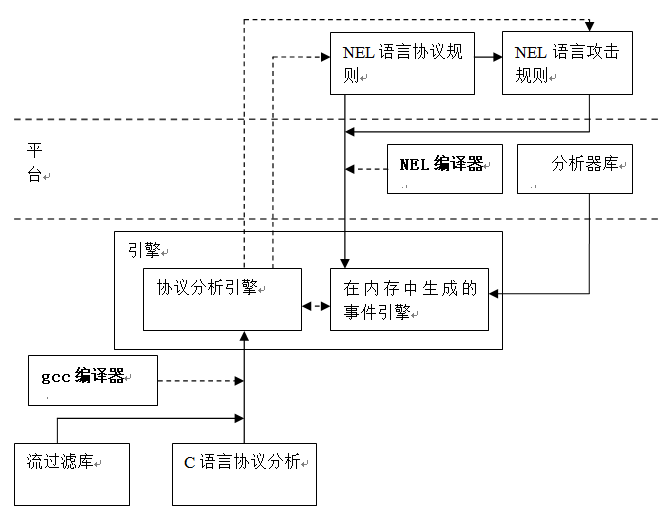
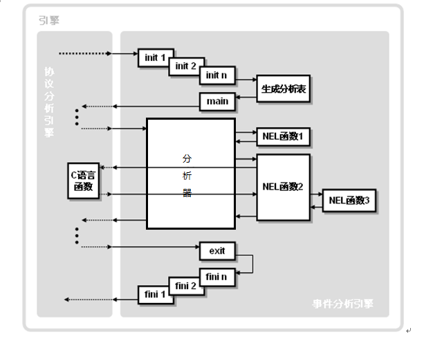
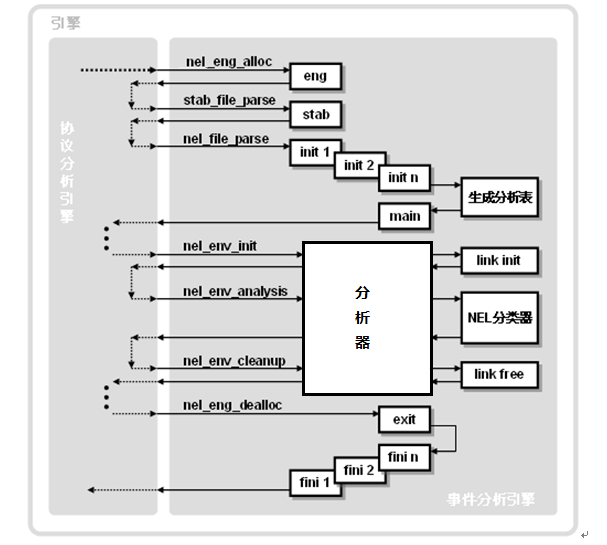

Network Event Language（NEL）用户手册

## 前 言

本文简要介绍NEL的语言的开发初衷、开发方法学和分层体系结构（协议分析引擎和事件分析引擎），重点介绍NEL的语言特性以及libnel提供的主要编程接口。

〖手册构成〗

1.  第1章，简要地介绍NEL的开发目的、开发模式、以及软件体系结构；

2.  第2章\~第11章，讨论预处理、类型、常量、枚举、变量、数组、指针、结构、联合、表达式、语句和函数；

3.  第12章，介绍NEL中的事件的概念；

4.  第13章，介绍NEL中的规则；

5.  第14章，介绍如何使用libnel提供的API制作引擎的全部过程；

由于NEL的设计目标之一是为了向C语言程序员提供一个简单易用的编程接口，所以，NEL的部分语法和C语言是非常相似的。因此，对C语言语法了解的NEL开发者可以直接阅读1、12、13以及14章。当然NEL语言和C语言的语法不是完全相同，或者即使形式上是相同的，但是在语义上也存在着一定的差异，需要读者注意加以区分。

〖手册约定〗

> 在本文中C语言将用正常字体表示，NEL将用斜体表示。

## 目 录

* [第1章 简介](#简介)

* [第2章 预处理](#预处理)

  *  [§2.1 include](#include)

  *  [§2.2 注释](#注释)

* [第3章 基本数据类型](#基本数据类型)

   * [§3.1 字符型（char）](#字符型char)

   * [§3.2 整型（int）](#整型int)

   * [§3.3 枚举型](#枚举型)

   * [§3.4 无值型（void）](#无值型void)

   * [§3.5 类型转换](#类型转换)

      * [§3.5.1 整形提升和浮点下降](#整形提升和浮点下降)

      * [§3.5.2 普通算术类型转换](#普通算术类型转换)

      * [§3.5.3 强制类型转换 ](#强制类型转换)

      * [§3.5.4 类型截短 ](#类型截短)

* [第4章 常量](#常量)

  * [§4.1 数字常量](#数字常量)

  * [§4.2 字符常量](#字符常量)

  * [§4.3 字符串常量](#字符串常量)

  * [§4.4 枚举](#枚举)

*[第5章 变量](#变量)

  * [§5.1 变量的命名](#变量的命名)

  * [§5.2 变量的连接](#变量的连接)

  * [§5.3 变量的作用域](#变量的作用域)

  * [§5.4 变量种类](#变量种类)

    * [§5.4.1 局部变量](#局部变量)

    * [§5.4.2 形式参数](#形式参数)

    * [§5.4.3 全局变量](#全局变量)

  * [§5.5 变量存储类型](#变量存储类型)

    * [§5.5.1 auto](#auto)

    * [§5.5.2 static](#static)

    * [§5.5.3 extern](#extern)

  * [§5.6 变量的声明和初始化](#变量的声明和初始化)

* [第6章 数组](#数组)

  * [§6.1 数组的声明/定义](#数组的声明定义)

    * [§6.1.1 一维数组](#一维数组)

    * [§6.1.2 多维数组](#多维数组)

  * [§6.2 数组的引用](#数组的引用)

  * [§6.3 数据区域](#数据区域)

* [第7章 指针](#指针)

  * [§7.1 指针的定义](#指针的定义)

  * [§7.2 数组指针](#数组指针)

  * [§7.3 字符指针](#字符指针)

  * [§7.4 指针数组](#指针数组)

* [第8章 结构和联合](#结构和联合)

  * [§8.1 结构、联合的说明和变量的定义](#结构联合的说明和变量的定义)

  * [§8.2 结构、联合变量的使用](#结构联合变量的使用)

  * [§8.3 结构和联合的区别](#结构和联合的区别)

* [第9章 运算符](#运算符)

  * [§9.1 算术运算符](#算术运算符)

  * [§9.2 关系运算符和逻辑运算符](#关系运算符和逻辑运算符)

    * [§9.2.1 关系运算符](#关系运算符)

    * [§9.2.2 逻辑运算符](#逻辑运算符)

  * [§9.3 按位运算符](#按位运算符)

  * [§9.4 字符匹配算符](#字符匹配算符)

  * [§9.5 特殊运算符](#特殊运算符)

    * [§9.5.1 "？"运算符](#运算符-1)

    * [§9.5.2 "&"和"\*"运算符](#和运算符)

    * [§9.5.3 "，"运算符](#运算符-2)

    * [§9.5.4 sizeof运算符](#sizeof运算符)

    * [§9.5.5 idof运算符](#idof运算符)

    * [§9.5.6 ridof](#ridof)

  * [§9.6 运算符的优先级](#运算符的优先级)

* [第10章 语句](#语句)

  * [§10.1 条件语句](#条件语句)

  * [§10.2 循环语句](#循环语句)

    * [§10.2.1 for循环](#for循环)

    * [§10.2.2 while循环](#while循环)

    * [§10.2.3 do-while 循环](#do-while-循环)

  * [§10.3 break和continue语句](#break和continue语句)

    * [§10.3.1 break语句](#break语句)

    * [§10.3.2 continue 语句](#continue-语句)

* [第11章 函数](#函数)

  * [§11.1 函数的说明与定义](#函数的说明与定义)

    * [§11.1.1 函数说明](#函数说明)

    * [§11.1.2 函数定义](#函数定义)

  * [§11.2 函数的调用](#函数的调用)

  * [§11.3 函数的返回](#函数的返回)

  * [§11.4 程序入口点](#程序入口点)

  * [§11.5 NEL库函数](#nel库函数)

    * [§11.5.1 字符串流stream](#字符串流stream)
    * [§11.5.2 正则表达式匹配](#正则表达式匹配)
    * [§11.5.3 精确串匹配](#精确串匹配)
    * [§11.5.4 字符串操作](#字符串操作)
    * [§11.5.5 shellcode检测](#shellcode检测)

  * [§11.6 C库函数](#c库函数)

* [第12章 事件](#事件)

  * [§12.1 事件的定义](#事件的定义)

  * [§12.2 目标事件](#目标事件)

  * [§12.3 连接事件](#连接事件)

  * [§12.4 空事件](#空事件)

* [第13章 规则](#规则)

  * [§13.1 事件变量的引用](#事件变量的引用)

  * [§13.2 谓词](#谓词)

  * [§13.3 事件关系算符](#事件关系算符)

    * [§13.3.1 归结'：'](#归结)

    * [§13.3.2 选择'\|'](#选择)
    * [§13.3.3 否定'\!'](#否定)

  * [§13.4 动作](#动作)

  * [§13.5 包含_empty的规则](#包含_empty的规则)

* [第14章 使用libnel提供的API生成引擎](#使用libnel提供的API生成引擎)

  * [§14.1 协议引擎的C语言准备](#协议引擎的c语言准备)

    * [§14.1.1 事件结构体](#事件结构体)

    * [§14.1.2 协议常量](#协议常量)

    * [§14.1.3 谓词函数](#谓词函数)

    * [§14.1.4 编译选项](#编译选项)
  * [§14.2 协议事件和规则](#协议事件和规则)
  * [§14.3 调用NEL API生成引擎](#调用NEL API生成引擎)

    * [§14.3.1 nel_eng](#nel_eng)

    * [§14.3.2 nel_env](#nel_env)

    * [§14.3.3 idof](#idof)

    * [§14.4.3 register_init和register_free](#register_init和register_free)

 
  * [§14.4 引擎的运行过程总结](#引擎的运行过程总结)

#  简介
为了描述攻击，IDS、IPS厂商都制作了一些攻击描述语言，比如NFR的N-Code语言、Emerald的P-BEST语言、STAT的STATL语言，此外Bro和Snort也各自有相应的攻击描述语言，但是上述的这些系统都没有清楚地将协议分析、攻击规则定义、攻击检测这些过程彻底地分开，这就导致必须由一个规模比较大的开发小组来维护整个系统的开发。

为了解决这个问题，我们设想了另外的一种开发模式，即将上述工作分配给协议分析小组、攻击分析小组、和事件过滤平台（以后将简称为平台）小组，由各小组独立完成，这样每个小组都在其领域内对系统进行不断地扩充而又不会影响其他小组。具体来说，平台小组负责维护事件检测逻辑的开发（如使用多少个线程来进行检测、如何检测、先检测哪些事件,再检测哪些事件等）,这样协议分析人员和攻击检测人员就不必通晓引擎的内部实现机制，便能够独立地处理各自领域内的问题。

为了实现此目标，NEL被设计成一种"事件描述语言"，它具有常用过程性语言的语言实体（变量、函数），能够以过程性的方式操作这些语言实体来完成运算。不仅如此，NEL还提供了事件、以及定义事件之间关系的规则。通过"事件"我们将平台、协议分析和攻击检测联系在一起。事件规则是描述性的，NEL编译器负责将这些描述性规则转换为过程性的内部结构，并能够高效地实现对事件的逐层推理。

NEL的核心设计思想是权衡描述能力、易用性、运行效率三者之间的关系，找到一个最佳的平衡点。一方面，NEL具有很强的描述能力，可以使管理者非常方便地描述各种应用逻辑，包括时序事件序列（顺序、继承、聚合等）和约束关系（包括各种逻辑表达式和谓词函数）；另一方面，NEL对规则在内存中的组织方式进行了大幅优化，将运行期所必需的运算降低到最低，提高了引擎的执行效率。

通过对特定NEL脚本进行编译自动生成某个特定协议的引擎的流程请见图4.1：

一般来说，使用平台实现某个应用级引擎，协议开发者首先必须使用C语言来书写协议分析过程中所需的处理函数（如从数据包中分析出协议事件的函数、以及对某些协议约束关系进行检验的函数），这些处理函数经过编译后生成目标代码（\*.o），然后和引擎库（libnel.a）链接后就形成了可执行的二进制文件。

其次，协议开发者需要使用NEL来书写协议规则，协议规则的主要目的是将C语言中定义的内存数据影射为NEL所能够理解的事件，这是通过event关键字来实现的，这些用NEL来描述的协议事件将为攻击规则开发者提供一个事件编程接口。

最后，攻击规则开发者将根据自己对于攻击特征的了解，使用上述事件编程接口对攻击进行定义（比如定义某个事件内部变量之间的约束关系，或者定义多个事件之间的约束关系），在此过程中，规则开发者依然可以使用宿主语言中的各种语言实体。

在这种模式下，C语言是一个宿主语言，而NEL是一个寄生语言，平台提供了无缝地使用宿主语言中的语言实体的功能，使得NEL的作者能够方便地利用C语言的遗产代码。

生成的引擎可以以"解释模式"和"编译模式"这两种方式下执行，在解释模式下，事件引擎直接根据语法树进行分类，在编译模式下，将调用编译后的分析函数而不再使用语法树进行分类，编译模式的分类效率要比解释模式高出一个数量级。目前的libnel只提供解释模式。

#  预处理

NEL目前支持的预处理只有#include和注释，暂时还不支持其他预处理命令（如宏），这可能给开发带来一些不方便，我们将视其重要性而决定是否在将来提供该功能。

##  include

在NEL中，我们需要引用其它已经编写好的NEL文件时，可以使用#include。比如，在attacks.nel文件中，我们使用：

<pre><em>
#include "attack_foo.nel"
#include "attack_bar.nel"
</em></pre>

将attack_foo.nel和attack_bar.nel中定义的攻击规则导入。和C语言不同，在NEL中不具有C编译器的制定搜索目录的功能（如GCC的-L参数），因此如果在foo.nel中使用了了：
<pre><em>
#include "bar.nel"
</em></pre>

那么bar.nel就必须和foo.nel在同一目录下。若bar.nel不在foo.nel所在的目录下，则必须使用相对路径：
<pre><em>
#include "../bar.nel"
</em></pre>

或者绝对路径：
<pre><em>
#include "/usr/local/etc/bar.nel"
</em></pre>

需要注意的是，上述相对路径的出发点是当前nel文件所在目录，而不是当前可执行程序所在的目录。这使得NEL开发者只需要考虑各个nel文件之间的目录关系，而无须考虑引擎程序在哪里运行。

##  注释

和C语言一样，在NEL中有两种编写注释的方式，一种是：
<pre><em>
/* this is a comment */
</em></pre>

另外一种是：
<pre><em>
// this is a comment
</em></pre>

#  基本数据类型

和C一样，NEL也是一种强类型语言，这意味着在NEL中每个变量在使用之前必须定义其数据类型。NEL有以下几种类型：整型(int)、字符型(char)、指针型(\*)、数组、结构(struct)
、联合(union)和枚举（enum）。NEL不支持浮点型(float)和双精度浮点型（double）。

##  字符型（char）

加上不同的修饰符，可以定义有符号和无符号两种类型的字符型变量，例如：
<pre><em>
char c;  // c被定义为有符号字符变量 
unsigned char u; // u被定义为无符号字符变量 
</em></pre>

字符在计算机中以其ASCII码方式表示，其长度为1个字节，有符号字符型数取值范围为-128～127，无符号字符型数取值范围是0～255。在NEL语言中，字符型数据在操作时将按整型数处理。

表3-1

|     **类型**     |     **说明**     | **字长（字节）**    |  **范围** | **简写** | 
|:-----------------|:---------------- |:--------------------:|:----------|:---------|
| signed char      | 有符号字符型      | 1                   | -128\~127  | char     |
| unsigned char    | 无符号字符型      | 1                   | 0\~255     |          |

在NEL中，char和 signed char是等价的，这些都是为了兼容GCC而设计的。

## 整型（int）

NEL中支持的整数类型和C语言是完全相同的，包含short int、 int 和 long int这三种有符号的类型和相应的无符号类型，unsigned short int，unsignedint和unsigned long int，各种类型的长度如下：

表3-2

|       **类型**      |    **说明**   | **字长**   |   **范围**    | **简写**        |
|---------------------|---------------|------------|----------------|-----------------|
| signed short int    | 有符号短整型   | 2          | -32768~32767  | short 或 short  |
| unsigned short int  | 无符号短整型   | 2          | 0~65535       | unsigned short  |
| signed int          | 有符号整型     | 4          | -2147483648~2147483647  | int             |
| unsigned int        | 无符号整型     | 4          | 0~4294967295  | unsigned        |
| signed long int     | 有符号长整型   | 4          | -2147483648~2147483647  | long、long int   |
| unsigned long int   | 无符号长整型   | 4          | 0~4294967295  | unsigned long   |

C语言C89标准规定较长的类型至少要占有与较短的类型一样的存储空间，但是具体的实现中int、short int以及long int可以采取同样的类型。为了使得NEL兼容gcc，避免对NEL和gcc的数据类型进行复杂的转换，上述这些数据类型所占据的存储空间和gcc 3.3.4完全一致。

NEL中不支持C语言中的浮点数类型（float，double，long double）。如果用户在NEL中使用了这三种关键字，将给出错误提示；如果在NEL中使用在C语言中定义的浮点数据类型的变量，则将该操作数的类型转换为整型类型的int、unsigned int、long int、unsigned long，小数部分将被丢弃。

##  枚举型

枚举型也是一种具有整型值的基本数据类型，枚举型中的每个名字都代表一个int类型的常量，我们会在 [枚举](#枚举)中仔细介绍枚举。

##  无值型（void） 

无值型字节长度为0，主要有两个用途：一是明确地表示一个函数不返回任何值；一是产生一个指向不确定类型的指针(可根据需要动态分配给其内存)。

例如：
<pre><em>
void *buffer; // buffer被定义为无值型指针 
</em></pre>

##  类型转换

某些运算符会引起操作数的值从某种类型转换为另外一种类型。类型转换涉及4个子问题："整形提升/浮点下降"，"算术类型转换"、"强制类型转换"和"数据截短"。"整形提升/浮点下降"涉及将数据从内存独到寄存器；"算术类型转换"、"强制类型转换"描述两个寄存器中的操作数的类型转换原则；"数据截短"描述将数据从寄存器写回到内存的类型转换原则
。

NEL中的类型转换原则甚至比C语言还要复杂，这是因为不光要保持NEL语言的本身的变量取值范围，还要考虑NEL中定义的变量向C语言变量的类型转换问题。

### 整形提升和浮点下降

在NEL中，一个char在内存中存储时所占据的存储空间的长度是1字节，但是在运行期，该字符被读入到寄存器中，并作为一个int来对待，这个过程叫做"整型提升"，"整型提升"的原则是：signed char、unsigned char、枚举类型、short int和unsigned short
int都被转换为int类型；

当操作数为C中定义的float、double、long double类型，则需要进行"浮点降低"操作，C中定义的float、double、long
double类型将被依次转换为int、long int、unsigned long，小数部分将被丢弃。

###  普通算术类型转换

大多数普通运算符都会在运算过程中引起类型转换，其效果是将所有的操作数转换为同一公共类型，并以此作为结果的类型，这种方式的转换称为普通算术类型转换。普通算术类型转换的规则为（转换过程遵循从下面的判断顺序）：

如果任何一个操作数为unsigned long int类型，则将另外一个操作数转换为unsigned long int；

否则，如果一个操作数为long int类型，且另外一个操作数为unsigned int类型，则结果依赖于long int类型是否可以用来表示所有的unsigned int类型的值，如果可以，则将unsigned int类型的操作数转换为long int；如果不可以，则将两个操作数都转换为unsigned long int类型；

否则，如果一个操作数为long int类型，则将另外一个操作数转换为long int类型；

否则，如果任何一个操作数为unsigned int类型，则将另一个操作数转换为unsigned int类型；

否则，将两个类型都转换为int类型。

### 强制类型转换

在任何表达式中都可以使用一种称为"强制类型转换"的一元运算符，强制进行显式的类型转换。强制转换的语法为：
<pre><em>
（类型名）表达式
</em></pre>

在上面的语句中，表达式将被转换为"类型名"所指定的类型。我们可以这样来理解强制类型转换的准确含义：表达式首先被赋值给类型为"类型名"的某个变量，然后再用该变量替换上述整条语句。

### 类型截短

当算术操作结束后，需要将结果写回到内存中去的时候，可能会发生类型截取。

上述转换原则（[整形提升和浮点下降](#整形提升和浮点下降) 、 [普通算术类型转换](#普通算术类型转换) 和 [强制类型转换](#强制类型转换) ）可能导致了一些和直觉不相符的计算结果。请看下面的例子，如果变量c被定义为char，则下面的循环永远不会退出：
<pre><em>
char c;
While ( c != 0xff ) {
    c --；
}
</em></pre>

根据上面的规则，c的类型为signed char，0xff的类型为int(没有后缀U的常量的缺省值为int，详见[数字常量](#数字常量))，其值为255(0xff)。当程序运行到c为0时，c\--操作后将得到-1(0xffffffff)，然后保存c的值到内存中，在这个过程中发生数据截短，c的值最终保存为0xff，在while语句执行过程中，对0xff进行整型提升，由于c是有符号数，因此进行符号扩充为-1(0xffffffff)，-1!= 255，表达式为真，于是不退出；

如果将上述c的类型改为unsigned char，while循环则可以退出，这是因为：根据原则[普通算术类型转换](#普通算术类型转换)，0xff将会被NEL提升为一个类型为unsigned int的0x000000ff来处理，这样在进行while判断的时候，对值为0xff 的c进行整型提升，由于c是无符号数，因此进行0扩充为0x000000ff，表达式为假，于是上诉循环退出。

#  常量

##  数字常量

整型常数按不同的进制有三种表示方法：如果它以0开头，则为8进制数，8进制数的范围是0\~7，如0777；以0x或者0X开头的为16进制数，如0XFF，16进制数除了包括0\~9之外，还包括a（或者A）\~f（或者F）；其他为十进制数。

另外，可在整型常数后添加一个L或l字母表示该数为长整型数，如22L，0773L，0Xae4l。若以字母u或者U为后缀，则表示它是一个无符号数。

每个整型变量都有一个缺省的类型，确定一个整型常量的类型的原则如下：

1.  如果没有后缀，对于十进制表示的整数，则该整数的类型根据类型可容许的空间依次为int、long int、unsigned long int；

2.  如果没有后缀，对于8或16进制整数，则该整数的类型根据类型可容许的空间依次为int、unsigned int、long int、unsigned long int；

3.  如果其后缀为字母u或U，其类型根据保留该数所分配的空间依次为：unsigned int、unsigned long int；

4.  如果其后缀为字母l或L，其类型根据保留该数所分配的空间依次为：long int、unsigned long int。

##  字符常量

字符常量是用单引号引起来的一个字符构成的序列，如\'a\'，\'9\'，\'Z\'，字符常量的值是ASCII码集中该字符所对应的数值，比如\'U\'的值是85，字符常量的缺省类型为char。

一些不能用符号表示的控制符，NEL中使用如\'\\ooo\'或者\'\\xhh\'表示。其中ooo代表1～3位八进制数，hh表示2位的16进制数，当然这种表示方法也适用于直接用符号表示的字符。

另外，NEL 中有些常用的字符用以下转义字符来表示：

表4-1

|       **符号**      |     **值**    |  **含义**    |
|---------------------|---------------|--------------|
|   \'\\f\'           |    \'\\X0C\'   |    换页     |
|   \'\\r\'           |    \'\\X0D\'   |    回车     |
|   \'\\t\'           |    \'\\X09\'   |    制表键   |
|   \'\\n\'           |    \'\\X0A\'   |    换行     |
|   \'\\\\\'          |    \'\\X5C\'   |    \\符     |
|   \'\\\'\'          |    \'\\X27\'   |    \'符     |
|   \'\\\"\'          |    \'\\X22\'   |    \"符     |
|   \'\\a\'           |                |    响铃     |
|   \'\\b\'           |                |    回退     |
|   \'\\?\'           |                |    问号     |
|   \'\\0\'           |    \'\\X00\'   |    空字符   |

##  字符串常量

字符串常量是用双引号括起来的由0个或者多个字符组成的字符序列，如：
<pre><em>
"hello，nel !"
"x"
</em></pre>

"x"和'x'的含义是不同的，后者是一个字符常量，其值是字母x在ASCII字符集中对应的数值，前者是包含一个字符'x'的以及一个结束符'\\0'的字符数组。

字符串常量的类型为字符数组，在内部存储字符串常量的时候，编译器会在字符串的最后一个位置上添加一个\'\\0\'，这样连续遍历字符串，就可以确认字符串常量的结束位置。

在字符串常量中，不可以直接使用双引号和换行符，如果需要使用这两个字符，需要使用转义符，转义符的格式和字符常量中使用的转义字符相同，比如在匹配缓冲区溢出shellcode时，我们将使用\"\\x83\\xc1\\x0A\\xFF\\xE1\"这样的字符串作为模式来进行匹配。

##  枚举

枚举常量是另外一种类型的常量，枚举是一些命名的整型常数的集合，其定义的形式如下：
<pre><em>
枚举说明符：
enum [枚举名] { 枚举符表}
enum [枚举名]
枚举符表： 枚举符
        | 枚举符表，枚举符
枚举符  ： 标识符
        | 标识符 = 常量表达式
</em></pre>

在进行了上面的定义后，凡是可以使用int类型常量的地方，就可以使用枚举符来代替并进行表达式运算。例如，定义了Boolean枚举型之后，就可以使用FALSE来代替0，使用TRUE来代替1。
<pre><em>
Enum Boolean {
    FALSE，
    TURE
};
</em></pre>

如果枚举没有初始化，即省掉"=常量表达式"时，则从第一个枚举符开始，顺次赋给枚举符0，1，2，\...的整数值。但当枚举中的某个成员赋值后（常量表达式的值可以为负数），其后的成员按依次加1的规则确定其值。

在NEL中我们可以直接使用在C语言中已经定义的枚举类型，这为我们使用有意义的名字访问在C中定义的常量提供了一种便利的方式。C语言中的宏无法做到这点，因为#define在C编译器的预处理阶段就被处理，它的值无法被NEL访问到。

在后面的例子中，我们会经常地用到枚举，但是要注意枚举的名字空间。"枚举名"具有单独的名字空间，这意味着NEL中不能定义两个相同的枚举名（但是可以一处是定义、一处是引用），这也意味着在C语言中定义的枚举名在NEL中不能作为新定义的枚举名出现（但是可以引用该枚举名）。

与此相对，"枚举符"没有自己的名字空间，枚举符存在于NEL的标识符空间内，这意味着枚举符名不能和C语言或者NEL语言中已经定义的标识符具有相同的名字，也意味着枚举符名也不能和C语言或者NEL语言中已经定义的其他枚举符具有相同的名字（但这并不妨碍同一枚举中不同的枚举符可以具有相同的值）。

#  变量

##  变量的命名

NEL规定所有变量在使用前都必须加以说明。一条变量说明语句由数据类型和其后的一个或多个变量名组成。变量的说明形式如下：
<pre><em>
类型 <变量表>;
</em></pre>

这里"类型"是指NEL中有效的数据类型。"变量表"是一个或多个标识符名，每个标识符之间用\",\"分隔，例如：
<pre><em>
int i，j，k;
unsigned char c，str[5]，*p;
</em></pre>

在定义变量的过程中，变量名必须满足以下规则：

1.  事件变量名是以美元符号开头后面带有一个或多个数字构成的，事件变量只能是系统自定义的，用户只能定义不以'\$'开头的普通变量；

2.  变量由一个字母(a\~z，A\~Z)或下划线开头，变量的其它部分可以用字母、下划线或数字(0\~9)组成；

3.  大小写字母表示不同意义，即代表不同的标识符；

4.  标识符只有前32个字符有效；

5.  标识符不能使用NEL的关键字。

所谓关键字就是已被NEL本身使用，不能作其它用途使用的字。例如关键字不能用作变量名、函数名等。
由ANSI标准定义的关键字共32个：
<pre><em>
auto, double, int, struct, break, else, long, switch, case, enum, register,
typedef, char, extern, return, union, const, float, short, unsigned, continue,
for, signed, void, default, goto, sizeof, volatile, do, if, while, static,
</em></pre>

NEL扩展的关键字共15个：
<pre><em>
event, atom, init, fini, exit, _target, _terminator, _empty, idof, ridof,
</em></pre>

6.  名字空间内标识符是唯一的。

在介绍变量的名字空间之前，我们简单地介绍一下NEL中的5个名字空间，所谓"名字空间"是指相同种类的标识符名所构成的集合，在同一名字空间内的不同标识符不能具有相同的名字，不同名字空间的标识符允许具有相同的名字。

在NEL语言中用户可以用标识符定义的实体包括：函数、结构标记、联合和枚举标记、结构或者联合成员、枚举常量、typedef、标号、事件以及变量等等。NEL将各种实体的命名空间划分为5种：

1.  标号名空间（S1）；

2.  结构、联合和枚举的标记空间（S2）；

3.  结构或联合的成员名空间，每一个结构或联合具有独立的成员名空间（S3）；

4.  由终结符、非终结符构成的事件空间（S4）

5.  所有其它的标识符名空间，称为普通标识符名空间（S5）。

变量存在于普通标识符名字空间（S5）内，而且NEL变量和C 变量共享这个名字空间，这意味着，如果在C语言中定义了一个全局非static变量x，此后在NEL中声明了一个同名的全局变量x'，我们将认为x'和x是同一变量。这样如果它们的type不匹配的话，则报错；如果x'为定义（比如char x'[100]），则报错。

##  变量的连接

之所以要讨论连接，是考虑到这样的一个问题，即在不同的nel单元中如何将每个符号引用和唯一的符号定义联系起来。为此我们扩展了C语言中对于强符号和弱符号的概念，我们定义：

-   C宿主语言程序中的所有全局非static变量是强符号（不管是否经过初始化）；

-   NEL中定义的全局变量是强符号；

-   NEL中声明的全局变量是弱符号。

我们使用Unix中Linker的规则来处理多处定义的符号：

1.  不允许有多个强符号；

2.  如果有一个强符号和多个弱符号，那么选择强符号；

3.  如果有多个弱符号，那么根据nel文件执行的顺序，选择第一个；

例如：

<pre><em>
/* foo.nel */
int x = 1;
</em></pre>

<pre><em>
/* bar.nel*/
int x = 2;
</em></pre>

Nel编译器将会提示一条错误信息，因为强符号x被定义了两次。而如果，其中一个为弱符号，则不会报错，比如：
<pre><em>
/* foo.nel */
int x ;
</em></pre>

<pre><em>
/* bar.nel*/
int x = 2;
</em></pre>

但是，如果其中一个文件是C文件（foo.c），则因为在宿主C程序中声明符号也是强符号，所以下面的情况下，nel编译器将会报告多次定义的错误。
<pre>
/* foo.c */
int x ;
</pre>

<pre><em>
/* bar.nel*/
int x = 2 ;
</em></pre>

##  变量的作用域

在同一名字空间内，如果变量属于不同的作用域，则可以同名。

变量的作用域规定了变量说明的有效范围。NEL 语言的标识符有4 种作用域：函数、文件、分程序（也称为复合语句或者块）和函数原型。

变量的作用域则取决于其说明所出现的位置。如果一变量的说明出现在函数体中，则该变量具有函数作用域；如果一变量的说明出现任何参数表与复合语句之外，则该变量具有文件作用域；如果一变量的说明出现在参数表或复合语句之内，则该变量具有block作用域；如果一变量的说明出现在一个函数原型的参数表之内，则该变量具有函数原型作用域。

属于不同作用域的实体允许同名。对同名标识符的多次说明，NEL采用了最小作用域原则，即内层的说明遮盖外层的说明直至内层退出。

##  变量种类

变量可以在程序中三个地方说明：函数内部、函数的参数定义中或所有的函数外部。根据所定义位置的不同，变量可分为局部变量、形式参数和全局变量。

###  局部变量 

局部变量是指在函数内部说明的变量（有时也称为自动变量）。

局部变量在函数调用时自动产生（但不会自动初始化），随函数调用的结束，这个变量也就自动消失了。下次调用此函数时变量将再次自动产生，还要再进行赋值，退出时又自动消失。

###  形式参数

形式参数是指在函数名后面的小括号里定义的变量，用于接受来自调用函数的参数。形式参数在函数内部可以象其它局部变量那样来使用，例如：
<pre><em>
foo(int x，int y)
{
    int i;   /*定义局部变量*/
    <程序体>
}
</em></pre>

其中x，y为函数的形式参数，不需要再进行说明就可在该函数内直接使用。

###  全局变量 

全局变量是指在所有函数之外说明的变量，它在整个程序内部是\"可见的\"，可以被任何一个函数使用，并且在整个程序的运行中都保留其值。

例如：
<pre><em>
int test;                 //定义全局变量
void f(void);             //子函数说明

void f (void)
{
    test=test * 10;
}

init
{
    test=5;              //给全局变量赋值
    f();                 //调用f()，test的值变为50
}
</em></pre>
  
由于全局变量可被整个程序内的任何一个函数使用，所以可作为函数之间传递参数的手段，但全局变量太多时，会导致内存开销变大。

##  变量存储类型 

NEL支持三种变量存储类型，自动、静态和外部，说明符分别为auto，static和extern。

###  auto 

在NEL中，auto规定变量为"自动"的。"自动"的含义是"变量对于程序块来说是局部的，在进入程序块时产生，在退出程序块时将被取消"。auto只能使用在局部变量之前，局部变量缺省的存储类型也是"自动"的，所以auto说明符实际上从来不用。

###  static 

我们把用static修饰的变量称为静态变量。根据变量的类型可以分为静态局部变量和静态全局变量。

1.  静态局部变量

它与局部变量的区别在于：在函数退出时，这个变量始终存在，但不能被其它函数使用；当再次进入该函数时，仍将保存着上次的结果，其它用法与局部变量一样。

2.  静态全局变量

NEL允许将大型程序分成若干独立模块文件分别维护，然后将所有模块一起读入，便于软件的管理和维护。

静态全局变量就是指只在定义它的源文件中可见，而在其它源文件中不可见的变量。它与全局变量的区别是：全局变量可以在其他文件中被说明为外部变量(extern，详见5.5.3节)从而被其它源文件使用；而静态全局变量却不能再被说明为外部的，即只能被它所在的源文件使用。例如：
<pre><em>
static int nid = 60102;
</em></pre>

这使得我们可以在所有的规则中使用相同的变量名，但又保持各个规则之间变量的独立。

###  extern 

我们把用extern 修饰的变量称为外部变量。

NEL编译器看到extern 修饰的变量，就知道该变量是在其他文件中定义的变量，于是不会为该变量分配任何实际的存储空间。例如：
<pre><em>
bar.nel：
extern int i，j;     //说明将i，j从文件1中复制过来
int func ()          //用户定义函数
{
    return ( i + j );
}

foo.nel：
int i，j;           //定义全局变量
init{
    int k;
    k = func ();
}
</em></pre>

  
##  变量的声明和初始化；

变量的初始化是指变量在被定义的同时赋给一个初值。

NEL中全局变量和静态变量在NEL编译器编译结束后就被初始化，并且在运行过程中不再执行初始化语句；显式初始化的自动变量（局部非静态变量）是在每次进入定义它们的函数或复合语句时才做初始化。

对于全局变量和静态变量，初值必须是常数表达式，如果没有明确的初始化则将被自动清零；而自动变量可以是任意的表达式，这个表达式可以包括常数、前面说明过的变量和函数，如果没有明确的初始化则其值是不确定的。例如：

<pre><em>
int m，n=1;               //定义全局变量，在初始化时m被清零，n被赋1
init
{
    static int i=10，j;   //定义静态局部变量，初始化时i被赋10，j为0
    int s;                //定义局部变量，不进行初始化，s值不确定
    int k=i*5;            //定义局部变量，初始化时k被赋10 * 5 = 50
}
</em></pre>

#  数组

所谓数组就是指具有相同数据类型的变量的一组集合，该集合由一段连续的存储地址空间构成，最低的地址空间保存第一个数组元素，最高的地址空间保存最后一个数组元素。数组中的每个特定元素都使用下标来访问。数组可以是一维的，也可以是多维的。

使用数组能够快速地将检查点定位到某个位置上，这使得NEL具备了描述复杂的攻击的手段。

##  数组的声明/定义

###  一维数组 

一维数组的声明格式是：
<pre><em>
类型  变量名[长度];
</em></pre>

其中的"类型"是指数组中每个元素的数据类型，包括整型、字符型、指针型以及结构和联合，"长度"表达式必须为整形，并且其值大于0，例如：
<pre><em>
char str[4];
</em></pre>

对于变量来说，变量的定义和初始化可以分离，与此不同，数组的初始化必须同数组的定义同时进行，数组的初始化的一般模式如下：
<pre><em>
类型  变量名[长度] = 初值表;
</em></pre>

初值表是用花括号括起来的初值序列，每个初值是一个表达式，例如：
<pre><em>
char str1[3]={'A'，'B'，'C'};
</em></pre>

对数组初始化时，如果初值表中的数据个数比数组元素少，则不足的数组元素用0来填补。在数组的的初始化过程中，有时"长度"表达式可以省略，这样的数组叫做不完整类型的数组，对于不完整类型的数组，NEL编译器是根据初值表中元素的个数来确定数组的长度，例如：
<pre><em>
char str2[] ={'a', 'b','c' };
</em></pre>

> 上面声明的str1数组包含3个元素，每个元素的类型为char，而str2虽然没有明确地定义为3个元素，但是根据初值表，str2也被定义为拥有3个元素（即'a','b','c'）的数组。

### 多维数组 

数组的类型除了上面所说的整型、字符型、指针型以及结构和联合，还可以是其他的数组，即构成多维数组，多维数组的一般说明格式是：
<pre><em>
类型  数组名[第1维长度] ...... [第n-1维长度] [第n维长度];*
</em></pre>

例如，在下面我们定义了一个整数型的二维数组array：
<pre><em>
int array[2][3];
</em></pre>

数组array中包含2个元素，而每个元素又是一个包含3个元素的数组，这样数组总共包含2*3=6个元素，多维数组的存储是按最后一维变化最快的原则来进行的，这6个元素在内存空间中的存储顺序为：
<pre><em>
array[0][0]，array[0][1]，array [0][2]，array[1][0]，array[1][1]，array [1][2];
</em></pre>

多维数组的初始化和一维的类似，但是是以递归的方式进行的，即初值表中每一个元素又是一个数组的初值表，例如：
<pre><em>
int array[2][3]={{2，-9，0}，{8，2，-5}}; 
</em></pre>

对于多维数组的初始化，只有第1维可以是不完整的，既可以不规定维数，而其他维必须明确地指定长度（即使可以从初值表中推断出该维的长度也是如此），例如：
<pre><em>
int z[][4]={{27，-5，19，3}，{1，8，-14，-2}};
</em></pre>

## 数组的引用

多维数组的引用的模式为：
<pre><em>
数组名[第1维下标] ...... [第n-1维下标] [第n维下标]
</em></pre>

"数组下标"可以使用任何整型的表达式，包括整型常量、整型变量、以及它们的组合构成的整型表达式。例如：
<pre><em>
array[0]
</em></pre>

数组都是以0作为第一个元素的下标，因此，当声明长度为16的整型数组a之后：
<pre><em>
int a[16]；
</em></pre>

开发者可以使用a[0]～a[15] 引用该数组的16个元素；

## 数据区域

数据区域是一种特殊形式的数组引用，其形式为：
<pre><em>
地址[起始offset，结束offset]
</em></pre>

表示一段数据区间，该区间的起始位置为"地址"+"起始offset"，结束位置为"地址"+"结束offset"，设置数据区域的目的是为了简化字符串匹配表达式的编写，目前数据区域还只能用于字符串匹配表达式，还不能应用到其他算符之上。

#  指针

##  指针的定义

从程序员的角度来看，使用变量的名字是对变量进行操作的主要形式，但是，变量的值实际上保存在计算机的存储区域中，CPU通过查看内存地址来访问或修改变量的内容。C语言提供了类似的通过使用变量地址对变量进行访问的机制------这就是指针类型，NEL继承了C语言的这个特性。

指针是一种新的数据类型，指针型的变量的一般定义为：
<pre><em>
类型标识符  *标识符;
</em></pre>

其中"标识符"是指针型变量的名字，标识符前的"\*"号，表示该变量是指针型变量，"类型标识符"表示该指针型变量所指向的变量的类型，例如：
<pre><em>
char *p;
</em></pre>

"\*"说明了它是一个指针型变量，char表示p是指向字符型的指针型变量。p用来存放一个字符型变量的地址，在使用指针型变量之前，一定要对它进行初始化，使得它指向一个变量的内存地址，这是通过一元运算符&做到的，下面语句：
<pre><em>
char c；
*p=&c;
</em></pre>

将把c的地址赋给指针型变量p，此时指针变量p指向字符型变量c，假设变量c的地址为1000，这个赋值可形象地用下图来表示：

既然在指针变量中只能存放地址，因此，在使用中不要将一个整数赋给一指针变量。下面的赋值是不合法的：
<pre><em>
p=10;
</em></pre>

如果不对指针进行初始化，则指针所指向的地址是不确定的，"不确定指针"不指向任何一个有意义的变量，使用"不确定指针"将会导致程序出现不可预期的情况，严重地将会导致出现程序保护错误，因此开发人员应该确保指针的有效性。

当指针型变量p被正确地初始化为c的地址后，开发人员便可以通过该该指针变量p间接访问变量c了，例如：
<pre><em>
x=*p;
</em></pre>

运算符"\*"访问以p为地址的存储区域中的值，而p中存放的是变量c的地址，因此，\*p访问的是地址为1000、长度为1字节的存储区域（因为是字符），它就是c所占用的存储区域，所以上面的赋值表达式等价于
<pre><em>
x=c;
</em></pre>

由于指针是变量，因此可以通过改变它们的值，以间接访问不同的变量，这给开发人员带来了灵活性，使代码编写起来更为简洁和有效。

例如，开发人员可以对一个指针加上或者减去一个整数n，NEL编译程序将根据所指对象的类型确定实际的增加量：如果指针指向的是char，则增加n，如果是int、short，则增加2\*n，如果指针指向的是结构（或联合），则增加结构（或联合）的长度乘以n。

## 数组指针

指针和数组有着密切的关系，任何能由数组下标完成的操作也都可用指针来实现。一般来说，用指针编写的程序比用数组下标编写的程序执行速度快，但用指针来实现的程序理解起来更困难一些。下面定义一个整型数组和一个指向整型的指针变量：
<pre><em>
int a[10]，*p;
</em></pre>

使用[指针的定义](#指针的定义)中介绍的方法，可以使整型指针p指向数组中第0号元素（即a\[0\]）：
<pre><em>
p=&a[0];
</em></pre>

指针变量p中的值为数组元素a\[0\] 的地址，又由于数组元素在内存中是连续存放的，因此，我们就可以通过指针变量p及其有关运算间接访问数组中的任何一个元素，例如p+1为a\[1\]的地址，p+i就为a\[i\]的地址。因此，下面两个表达式是等价的：
<pre><em>
x = a[i];
x = *(p+i);
</em></pre>

##  字符指针

在NEL程序中出现字符串常量时，NEL编译器就给字符串常量安排一个静态的不可写的存储区域，该存储区域在程序运行的过程中始终被该字符常量占据。在安排存储区域时，NEL编译器还自动给该字符串序列的末尾加上一个空字符\'\\0\'，用来标志字符串的结束，因此一个字符串常量所占的存储区域的字节数比相应的字符串常量的字符个数多一个字节。

NEL中使用字符串指针的方法是，用字符指针指向字符串常量所占据的存储空间的地址，然后通过字符指针来访问字符串存储区域。当字符串常量在表达式中出现时，根据数组的类型转换规则，它被转换成字符指针：
<pre><em>
char *p = "hello,nel";
</em></pre>

p指向字符串常量中的第0号字符'h'，以后我们可通过p来访问这一存储储区域。如\*p就是字符'h'，而\*(p+i)就相当于字符串的第i个字符，但是由于该存储区域是不可写的，因此不能对字符串常量进行修改，即下面的赋值是错误的：
<pre><em>
*p = 'a';
</em></pre>

如果，开发人员希望能够修改字符串常量，那么应该使用字符数组来保存字符串常量：
<pre><em>
char a[]="hello,nel";
</em></pre>

在这种初始化方式中，数组a是开辟在栈（如果a是一个局部变量）或者在可写的全局初始化数据段中（如果a是一个全局变量），不管在哪种情况下，NEL编译程序都直接把字符串复写到数组中，使得开发人员可以修改该字符串数组的值。

## 指针数组 

在NEL的规则书写过程中，经常要使用到一系列的不等长的字符串，使用二维数组处理长度不等的字符会浪费很多空间，于是我们设想用指向字符串常量的指针来构成一个数组，这就是指针数组。

指针数组中的每个元素都是指针变量，根据数组的定义，指针数组中每个元素都为指向同一数据类型的指针。指针数组的定义格式为：
<pre><em>
类型标识 *数组名[长度];
</em></pre>

例如，在下面定义了一个具有3个元素的指针数组，数组中的每个元素都是指向字符型的指针：
<pre><em>
static char * black_list[] = { "foo"， "bar"， "bla" };
</em></pre>

指针数组和一般数组一样，允许在定义时初始化，但由于指针数组的每个元素是指针变量，它只能存放地址，所以对指向字符串的指针数组赋初值时，要把字符串的首地址赋给指针数组的对应元素。

#  结构和联合

结构是C语言中的一种重要的复合数据类型，结构由若干个基本数据类型构成，并用一个标识符来命名，使用结构，可以方便地将具有相同归属关系的数据结构组织在一起，为开发人员提供了很大的便利，NEL继承了C语言中的结构。

##  结构、联合的说明和变量的定义 

定义结构、联合的一般格式如下所示，"类型"为前面所讲述的几种数据类型（整型、字符型、数组型、指针型、无值型和结构/联合类型），结构包括至少一个成员：

<pre><em>
struct/union 结构名
{
    类型  成员名;
    类型  成员名;
    ...
};
</em></pre>

下面这个例子定义了一个名字为*smtp_info_user*的结构：
<pre><em>
struct smtp_info_user{
    int vrfy_cnt;
};
</em></pre>

一旦开发人员使用NEL定义了一个结构类型，就可以使用该结构类型来定义一个结构变量，如：
<pre><em>
struct smtp_info_user user;
</em></pre>

开发人员也可以使用在宿主C语言中定义过的结构来定义结构变量。这种定义是透明的，就是说NEL开发人员并不需要做任何特殊的声明直接使用结构名进行定义即可。例如：
<pre><em>
struct smtp_info_user *user1，*user2;
</em></pre>

在NEL中，目前还不能象C语言那样支持Bitfield方式的结构体定义，也不能引用宿主C程序中以Bitfield方式定义的结构体。如果使用了宿主C语言中定义的包含Bitfield的结构体，将会导致不可预期的行为。

##  结构、联合变量的使用

可以象其它类型变量一样对结构变量进行初始化操作，但是不能对结构变量直接进行赋值操作，如果希望进行赋值操作，则只能以结构成员作为基本单位进行。结构成员的表示方式为：
<pre><em>
结构变量.成员名
</em></pre>

可以将"结构变量.成员名"看成一个变量，
该变量的数据类型与结构中该成员的数据类型相同，对该变量可以进行所有变量操作，例如：
<pre><em>
user.vrfy_cnt++；
</em></pre>

结构数组就是由若干个类型相同的结构变量组成的集合，使用下面的方式可以定义包括两个*struct smtp_info_user*类型的元素的数组user：
<pre><em>
struct smtp_info_user user[2];
</em></pre>

当我们想引用结构数组的某元素的某成员的时候，先使用数组脚标确定数组元素，然后再按照成员的引用方式来引用数组元素的成员，比如：
<pre><em>
user[1].vrfy_cnt
</em></pre>

结构指针是指向结构的指针。它由一个加在结构变量名前的"\*"操作符来定义，例如用前面已说明的结构定义一个结构指针如下：
<pre><em>
struct smtp_info_user *puser ;
</em></pre>

与结构变量的成员的引用方式不同，引用结构指针所指向的结构体变量的某个结构成员的方式为：
<pre><em>
结构指针名->结构成员
</em></pre>

因此*puser-\>vrfy_cnt*就是*puser*这个指针所指向的结构体*struct smtp_info_user*的*vrfy_cnt*成员，也就是 *(\*user).vrfy_cnt* 的缩写形式。例如要给上面定义的结构中*vrfy_cnt*赋值，可以用下面语句：
<pre><em>
puser->vrfy_cnt = 1;
</em></pre>

结构指针在使用之前应该初始化，即分配整个结构长度的内存空间，这可用nel函数*nel_malloc*来完成：
<pre><em>
puser =(struct smtp_info_user \*)nel_malloc(sizeof(struct smtp_info_user));
</em></pre>

*sizeof(struct smtp_info_user)*确定结构体*smtp_info_user*的长度，*nel_malloc()*函数分配了一个大小为结构长度的内存区域，然后将其首地址作为结构指针返回。

##  结构和联合的区别

结构和联合是非常相似的，它们具有相同的定义和引用的方式，在结构体中，不同的成员使用不同的空间，因此，在任意时刻，开发人员都可以完全独立地处理不同的结构变量成员，而在联合中，不同的成员公用同一存储空间，联合变量的长度为联合中最大的成员的长度，因此在任一时刻，联合中只有一个成员是有效的。

这意味着对于联合的某个成员进行赋值，将会修改其它成员的内容；而对于结构的不同成员赋值是互不影响的。联合的这个特性可能会迷惑初级的开发人员，但是，恰当地选用联合，可以使那些无需同时保留的成员的数目降到最低，从而减少内存的消耗。

#  运算符

NEL的运算符非常丰富，除了支持C语言的"算术运算符"、"关系运算符与逻辑运算符"、"按位运算符"外，还支持"字符串匹配算符"，除此之外还有一些用于完成特殊任务的运算符，下面分别进行介绍。

##  算术运算符 

在NEL中，包含了C语言中的加、减、乘、除、取模的运算，NEL的算术运算符如下：

表9-1 NEL的算数运算符

|              **操作符**           |            **作用**               |
|-----------------------------------|-----------------------------------|
| \+                                | 双目：加, 单目：正                 |
| \-                                | 双目：减, 单目：负                 |
| \*                                | 乘                                |
| /                                 | 除                                |
| \%                                | 取模                              |
| \--                               | 减1                               |
| ++                                | 加1                               |

在该表中，所谓单目操作是指对一个操作数进行操作。例如：-a是对a进行单目负操作。双目操作(或多目操作)是指对两个操作数(或多个操作数)进行操作。

##  关系运算符和逻辑运算符 

### 关系运算符 

关系运算符是比较两个操作数大小的符号，当结果为假时，相应的关系表达式的值为0，当结果为真的时候，关系表达式的结果值为1，NEL的关系运算符如下：

表9-2 NEL的关系运算符

|              **操作符**           |            **作用**               |
|-----------------------------------|-----------------------------------|
| \>                                | 大于                              |
| \>=                               | 大于等于                          |
| \<                                | 小于                              |
| \<=                               | 小于等于                          |
| ==                                | 等于                              |
| !=                                | 不等于                            |

### 逻辑运算符 

逻辑运算符是指用形式逻辑原则来建立数值间关系的符号。NEL的逻辑运算符如下：
表9-3 NEL的逻辑运算符

|              **操作符**           |            **作用**               |
|-----------------------------------|-----------------------------------|
| &&                                | 逻辑与                            |
| \|\                               | 逻辑或                            |
| !                                 | 逻辑非                            |

##  按位运算符 

NEL提供了和C语言类似的按位运算符，位运算对字节或字中的位（bit）进行检测、设置或移位，它只适用于字符型和整数型变量，NEL中按位运算符有：

表9-4 NEL的按位运算符

|              **操作符**           |            **作用**               |
|-----------------------------------|-----------------------------------|
| &                                 | 按位与                            |
| \|                                | 按位或                            |
| \^                                | 按位异或                          |
| \~                                | 按位取反                          |
| \>\>                              | 右移                              |
| \<\<                              | 左移                              |

## 字符匹配算符

在编写攻击规则的过程中，很多情况下需要使用字符串匹配，在NEL中，提供了表达能力很强的字符串匹配算符，利用字符串匹配算符构成字符匹配表达式的形式是：

<pre><em>
数据区域 字符匹配算符 正则表达式
流 字符匹配算符 正则表达式
</em></pre>

字符串匹配算符包括匹配算符"\~"和非匹配算符"!\~"，前者表示匹配，后者表示不匹配。这两个算符的左部为待匹配数据表达式，它或者是一个数据区域（参考[数据区域](#数据区域)），比如：

<pre><em>
$1->data[0，$1->data_len] \~ /abc/i
</em></pre>

或者是一个指向*struct stream*类型的指针：
<pre><em>
$1 !~ /abc/i
</em></pre>

字符串匹配算符之后的部分就是正则表达式， */abc/i*中"/"是分隔符，两个"/"之间的就是表达式。第二个"/"后面的字符串"i"是修饰符。

NEL中使用的正则表达式是和PCRE兼容的。一个正则表达式，分为三个部分：分隔符，表达式和修饰符。分隔符"/"的作用是表示表达式的开始和结束；表达式由一些特殊字符（特殊字符详见下面）和非特殊的字符串组成；修饰符用来开启或者关闭某种功能或模式。比如下面的正则表达式可以匹配一个简单的电子邮件地址字符串：
<pre><em>
/[a-z0-9_-]+@[a-z0-9_-.]+/
</em></pre>

在表达式中如果含有分隔符，那么就需要使用转义符号"\\"。比如：
<pre><em>
/hello.+?\/hello/is
</em></pre>

转义符号除了用于分隔符外还可以用于其它特殊字符，下面这些特殊字符在转义符号"\\"转义后代表的含义如下：

1. s：匹配单个的空格符

2. S：用于匹配除单个空格符之外的所有字符。

3. d：用于匹配从0到9的数字，相当于"/\[0-9\]/"。

4. w：用于匹配字母，数字或下划线字符，相当于"/\[a-zA-Z0-9\_\]/"。

5. W：用于匹配所有与w不匹配的字符，相当于"/\[\^a-zA-Z0-9\_\]/"。

6. D：用于匹配任何非10进制的数字字符。

正则表达式中的特殊字符分为元字符、定位字符等。元字符是正则表达式中的一种有特殊意义的字符，用来描述其前导字符（即元字符前面的字符）在被匹配的对象中出现的方式。元字符本身是一个单一的字符，但是不同或者相同的元字符组合起来可以构成大的元字符。

元字符包括：

1.  \".\"：点字符用于匹配除换行符之外的所有字符，如果经过修饰符"s"的修饰，"."可以代表任意字符；

2.  \"{\" 和 \"}\"：大括号用来精确指定匹配元字符出现的次数。

例如/pre{1,5}/表示匹配的对象可以是\"pre\"、\"pree\"、\"preeeee\"这样在\"pr\"后面出现1个到5个\"e\"的字符串。或者"/pre{,5}/"代表pre出现0此到5次之间。

3.  \"+\"：加字符用来匹配元字符前的字符出现一次或者多次。

例如/ac+/表示被匹配的对象可以是\"act\"、\"account\"、\"acccc\"等在\"a\"后面出现一个或者多个\"c\"的字符串，"+"相当于"{1,}"。

4.  \"\*\"：星号字符用来匹配元字符前的字符出现零次或者多次。

例如/ac\*/表示被匹配的对象可以是\"app\"、\"acp\"、\"accp\"等在\"a\"后面出现零个或者多个\"c\"的字符串。"\*"相当于"{0,}"。

5.  \"?\"：问号字符用来匹配元字符前的字符出现零次或者1次。

例如/ac?/表示匹配的对象可以是\"a\"、\"acp\"、\"acwp\"这样在\"a\"后面出现零个或者1个\"c\"的字符串。

\"?\"还有一个重要的作用，即\"贪婪模式\"，比如要匹配以字母"a"开头字母"b"结尾的字符串，但是需要匹配的字符串在"a"后面含有很多个"b"，比如"abbbbbbbbbbbbbbbbb"，那正则表达式是会匹配第一个"b"还是最后一个"b"取决于是否使用了贪婪模式，如果使用了贪婪模式，那么会匹配到最后一个\"b\"，反之只是匹配到第一个"b"。

使用贪婪模式的表达式如下：
<pre><em>
/a.+?b/
/a.+b/U
</em></pre>

不使用贪婪模式的如下：
<pre><em>
/a.+b/
</em></pre>

6.  \"\[\" 和 \"\]\"：方括号字符可以用来匹配"\[\]"之中出现过的字符。
比如/\[az\]/可以匹配单个字符"a"或者"z"；如果把上面的表达式改成这样/\[a-z\]/，就可以匹配任何单个小写字母，比如"a"、"b"等等。

如果在"\[\]"中出现了"\^"，代表本表达式不匹配"\[\]"内出现的字符，比如/\[\^a-z\]/不匹配任何小写字母！并且正则表达式给出了几种"\[\]"的默认值：
  \[：alpha：\]：匹配任何字母
  \[：alnum：\]：匹配任何字母和数字
  \[：digit：\]：匹配任何数字
  \[：space：\]：匹配空格符
  \[：upper：\]：匹配任何大写字母
  \[：lower：\]：匹配任何小写字母
  \[：punct：\]：匹配任何标点符号
  \[：xdigit：\]：匹配任何16进制数字

7.  \"\|\"：或符号的意思是可以是某个字符或者另一个字符串。

比如/abcd\|dcba/可以匹配\"abcd\"或者\"dcba\"。

8.  \"(\" 和\")\"：括号算符将所括起来的部分作为一个整体来处理。

比如/(abcd\|dcba)+ /可以匹配由至少一个\"abcd\"或者\"dcba\"构成的序列。

定位字符是正则表达式中又一类非常重要的字符，它的主要作用是用于对字符在匹配对象中的位置进行描述。

定位字符：

1.  \^：表示匹配的模式出现在匹配对象的开头（和在"\[\]"里面不同）。

比如/\^he/可以匹配以\"he\"字符开头的字符串，比如hello、height等等；

2.  \$：表示匹配的模式出现在匹配对象的末尾。

比如/he\$/：可以匹配以\"he\"字符结尾的字符串即she等；

3.  空格：表示匹配的模式出现在开始和结尾的两个边界之一。

比如空格开头的/ he/，和\^的作用一样，匹配以he开头的字符串，以空格为结束的/he /和\$的作用一样，匹配以he结尾的字符串。 /\^he\$/表示只和字符串\"he\"匹配。

在正则表达式里面的修饰符可以改变表达式的很多特性，使得正则表达式更加适合特殊的需要（注意：修饰符对于大小写是敏感的，这意味着\"i\"并不等于\"I\"）。NEL支持的修饰符只有"I"，如果在修饰符中加上\"i\"，则正则将会取消大小写敏感性，即\"a\"和\"A\"是一样的。

##  特殊运算符 

### "？"运算符 

"?"运算符的一般形式是：
<pre><em>
<条件表达式>?<表达式1>: <表达式2>;
</em></pre>

首先计算条件表达式的值，如果为真，则求表达式1的值并把它作为整个表达式的值；如果条件表达式的值为假，则求表达式2的值并把它作为整个表达式的值。

### "&"和"\*"运算符

"&"运算符是返回操作数地址的单目操作符。"\*"运算符是对"&"运算符的逆，它返回位于这个地址内的值。在介绍指针的概念时我们已经介绍过它们了，这里就不赘述。

### "，"运算符 

"，"运算符用于连接多个表达式，连接的含义是：依次计算所有左表达式（但是计算结果将被丢弃），而右表达式的值将作为整个表达式的结果。

### sizeof运算符 

sizeof运算符是一个单目运算符，它返回类型的长度（以字节为单位）。例如：
<pre><em>
sizeof(long)
</em></pre>

sizeof运算符也可以用来确定已定义的变量占据的存储空间的长度（以字节为单位），例如，array是一个包含10个元素的字符数组，则*sizeof(array)* 的值将为10。

### idof运算符

idof（）运算符是一个单目运算符，它返回某个事件的id，例如：
<pre><em>
foo_id = idof("foo");
</em></pre>

另外，需要注意的重要的问题是，idof能且仅能在main{}中被调用，而不能在init中被调用。这是因为只有在main中，各个事件的编号才被确定下来，而在init时，foo事件可能被分配了id号，也可能没有分配。比如在下面这种情况下，id就是无效的：
<pre><em>
event void *foo;
init {
    foo_id = idof ( "foo");
}
</em></pre>

如果idof在其它函数中被调用，也会产生这样的问题：
<pre><em>
event void *foo;
set_id()
{
    foo_id = idof ("foo");
}

init {
    set_id();
}
</em></pre>

因为NEL编译器在处理set_id的时候，没有办法判断set_id是在foo事件声明之后还是声明之前被调用的，所以在任意的函数中使用idof可能导致错误的结果。而main是在所有的事件、规则都得到处理之后才执行的。

为此，我们强制性地规定，idof只能在main {} 中调用，而不能在其它的程序入口或者函数中调用。

### ridof

在一些应用中，开发人员希望根据以数字方式命名的文件名来提取规则id，这可以通过使用ridof来实现。引擎初始化时，NEL解析程序在解析到ridof的时候，将根据文件名字中所包含的数字来确定规则id，然后开发人员可以将规则id记录到一个static变量中，以后就可以使用该变量来发送报警事件了。

##  运算符的优先级 

当一个表达式中有多个运算符参加运算时，如何确定运算的次序呢，在NEL中是通过运算符的优先级来确定的，NEL的算符优先级在下表中规定，表中优先级从上往下逐渐降低，同一行优先级相同。

表9-5 NEL运算符的优先次序

  
|  **优先级**  |  **运算符**                                                  |
|--------------|--------------------------------------------------------------|
|  最高        | ()(小括号) \[\](数组下标) .(结构成员) -\>(指针型结构成员)      |
|              | \~(匹配) !\~(不匹配)                                          | 
|              | !(逻辑非) \~(位取反) -(负号) ++(加1) \--(减1) &(变量地址)     |
|              | \*(指针所指内容)  type(函数说明)                              | 
|              | sizeof(长度计算) idof(事件id) ridof（类型）                   |
|              | \*(乘)     /(除)     %(取模)                                  |
|              | +(加)     -(减)                                               |  
|              | \<\<(位左移)          \>\>(位右移)                            |
|              | \<(小于)   \<=(小于等于)   \>(大于)   \>=(大于等于)            |
|              | ==(等于)       !=(不等于)                                     |
|              | &(按位与)                                                     |
|              | \^(按位异或)                                                  |
|              | \|(按位或)                                                    |
|              | &&(逻辑与)                                                    |
|              | \|\|(逻辑或)                                                  |
|              | ?：(?表达式)                                                  |     
|              | =    +=   -=(联合操作)                                        |
|  最低        | ，(逗号运算符)                                                |    

# 语句

NEL提供了丰富、灵活的控制流程语句，主要有：条件语句、循环语句和跳转语句。下面将对这些语句作详细介绍。

##  条件语句

和C语言一样，NEL也提供了条件语句。在NEL中条件语句的一般形式为：
<pre><em>
if(表达式) {
    语句1;
}else {
    语句2;
}
</em></pre>

NEL首先判断表达式的值，如果表达式的值为真，则执行语句1，然后跳过语句2继续向下执行，如果表达式为假，则跳过语句1而执行语句2，条件执行语句中*"else {语句2;}"*部分可以省略，此时条件语句变成：
<pre><em>
if(表达式) {
    语句1;
}
</em></pre>

在这种情况下，表达式的值为真则执行语句1，否则跳过语句1继续执行。在C语言中，如果语句1或语句2只有一条语句要执行时，可以省略"{"和"}"，即：
<pre>
if(表达式)
    语句体1;
else
    语句体2;
</pre>

这种情况带来了很多容易混淆的地方，有时很难判断出哪个if对应哪个else，因此在NEL中取消了这种方式。但是在NEL中保留了C语言中的阶梯式的if-else-if结构，阶梯式结构的一般形式为：
<pre><em>
if(表达式1) {
    语句1;
}
else if(表达式2) {
    语句2;
}
else if(表达式3) {
    语句3;
}
...
else {
    语句n;
}
</em></pre>

这种结构是从上到下逐个对条件进行判断，一旦发现条件满点足就执行与它有关的语句，并跳过其它剩余阶梯；若没有一个条件满足，则执行语句n。最后这个else常起着"缺省条件"的作用。

##  循环语句 

NEL提供三种基本的循环语句：for语句、while语句和do-while语句。

### for循环 

for循环的一般形式为：
<pre><em>
for (<初始化表达式>; <条件表达式>; <增量表达式>) {
    语句;
}
</em></pre>

初始化表达式用来给循环控制变量赋初值；条件表达式是一个关系表达式，它决定什么时候退出循环；增量表达式定义每循环一次后循环变量按什么方式变化。这三个部分之间用";"分开，例如：
<pre><em>
for (i=1; i<=100; i++) {
    sum ++;
}
</em></pre>

上例中先给i赋初值1，判断i是否小于等于100，若是则执行sum++语句，之后i值增加1，再重新判断i是否小于等于100，直到条件为假，即i\>100时，结束循环。

for循环中的"初始化表达式"、"条件表达式"和"增量表达式"都是可选项，可以省略，但";"不能省略。省略了初始化表达式，表示不对循环控制变量赋初值；省略了条件表达式，则成为无限循环（需要在语句中明示地退出这个无限循环）；省略了增量表达式，则不对循环控制变量进行操作，这时可在语句体中加入修改循环控制变量的语句。

### while循环 

while循环的一般形式为：
<pre><em>
while (条件表达式) {
    语句;
}
</em></pre>

当条件表达式为真时，便执行while循环中的语句，直到条件为假才结束循环，并继续执行循环程序外的后续语句。例如：
<pre><em>
int i;
while ( i < 100) {
    i++;
}
</em></pre>

与for循环一样，while循环总是在循环的头部检验条件，这就意味着循环可能什么也不执行就退出。

### do-while 循环 

do-while 循环的一般格式为：
<pre><em>
do {
    语句;
}while(条件);
</em></pre>

do-while循环与while循环的不同在于：它先执行循环中的语句，然后再判断条件是否为真，如果为真则继续循环；如果为假，则终止循环。因此，do-while循环至少要执行一次循环语句。

##  break和continue语句 

### break语句

break语句通常用在for、while、do-while循环语句中，break可使程序终止循环而执行循环后面的语句。break语句一般与if语句在一起，该if语句中的条件表达式充当跳出条件，当满足该条件时便跳出循环。
例如：
<pre><em>
int i;
for(i = 0; i < ehlo_black_list_num; i++) {
    if( strstr(data，ehlo_black_list[i]) != 0) {
        print("nel_strstr matched!\n");
        break;
    }
}
</em></pre>

需要注意的是，break语句不是跳出当前的括号对，而是跳出最靠近的for、while或者do-while循环，并且在多层循环中，一个break语句只向外跳一层。

### continue 语句

continue语句只能出现在for、while、do-while循环语句内，它的作用是跳过循环体中剩余的语句而强行执行下一次循环。continue语句通常与if语句一起使用，用来加速循环。

例如：
<pre><em>
int i;
for(i = 0; i < ehlo_black_list_num; i++) {
    if( nel_strstr(data，ehlo_black_list[i]) == 0) {
        continue；
    }
    return 1;
}
</em></pre>

# 函数

NEL函数是完成一定相关功能的执行代码段。我们可以把函数看成一个"黑盒子"，程序开发人员只要将数据送进去就能得到结果，而函数内部究竟是如何工作的，外部程序是不知道的。外部程序所知道的仅限于"输入给函数什么"，以及"函数输出什么"。函数提供了逐层细化的编制程序的手段，使得程序各部分之间相互独立、任务单一，并且易于理解、修改和维护。

在C语言中，整个程序从main()函数开始执行，由于目前NEL程序是作为寄生语言存在的，它只能从C语言中被调用，不存在"开始执行"的问题。但是，由于存在一些在系统运行前需要NEL参与的初始化工作（以及在事件分析引擎结束后的清理工作），我们提供了初始化入口函数（init、main）和出口函数(fini、exit)，它们分别在事件过滤引擎的初始化和结束阶段被调用，我们将在[程序入口点](#程序入口点)中详细介绍。

NEL函数的执行模式有解释模式和编译模式两种。在解释模式下，NEL编译器在预处理期间将NEL函数翻译为抽象语法树（AST，Abstract Syntax Tree），然后在执行期，分析器直接根据该NEL函数的AST进行解释执行。但解释模式下的执行效率会比较差，为了进一步提高NEL语言的执行效率，我们提供了编译模式。在编译模式下，AST将被NEL编译器进一步编译为二进制的机器指令，并进行动态内存链接。这样，在执行阶段分析器将调用编译后的NEL函数，这使得编译模式的分类效率要比解释模式高出一个数量级。注意，目前开源的libnel只包含解释模式。

在NEL中可以使用C语言中定义的函数，也可以使用NEL中定义的函数，另外开发者还可以使用libnlib.so中定义的NEL库函数（将在[NEL库函数](#NEL库函数)介绍）以及C库函数（将在[C库函数](#C库函数)介绍）。在本章中，我们重点讲述NEL函数的定义和调用，在NEL中能够定义函数的能力提高了NEL的灵活性。

##  函数的说明与定义 

NEL中所有函数在使用之前必须声明或定义。所谓"声明"是指对函数的类型进行说明，而并非为函数预留存储空间。只有在进行函数定义的时候，NEL编译器才会为函数预留存储空间。

### 函数说明 

NEL中函数的说明方式和ANSI 方式是一致的，但不兼容K&R的早期模式：
<pre><em>
函数类型  函数名(数据类型  形式参数, 数据类型  形式参数, ...... );
</em></pre>

其中，函数类型是该函数返回值的数据类型，可以是以前介绍的整型、字符型、以及指针（包括结构指针），也可以是无值型（void），无值型表示函数没有返回值。

函数名为函数的标识符，小括号中的内容为该函数的形式参数声明，如：
<pre><em>
char *foo(void);                //返回字符串指针，参数为空
void bar(int n，char *str);     //返回为空，两个参数，一个是int型，一个是char *型 
</em></pre>

### 函数定义

函数定义就是确定该函数完成什么功能以及怎么运行，如果一个函数已经被定义了，那么该函数等价于被声明过了，NEL对函数的定义方式如下：

<pre><em>
函数类型  函数名(数据类型 形式参数; 数据类型 形式参数 ... )
{
    函数体;
}
</em></pre>

例如：
<pre><em>
int my_ehlo_black_list_match(char *data，int len)
{
    int i;
    for(i = 0; i < len; i++) {
        if ( nel_strstr(data，data[i]) != 0) {
            print(\"nel_strstr matched!\\n\");*
            return 1;
        }
    }
    return 0;
}
</em></pre>

其中函数类型和形式参数的数据类型为NEL中的各种基本数据类型和派生数据类型。函数体是由一条或者多条NEL语句构成的，并包括在一对大括号"{"和"}"中。

需要指出的是，对于用户自定义函数的位置没有限制，可以在init{}函数前，也可以在其后。NEL将所有非static函数都被认为是全局性的，可以在其他文件中使用它们。

##  函数的调用

调用NEL函数时直接使用函数名和实参的方法，也就是将参数按该函数说明的参数顺序传递过去，然后进入子函数运行，运行结束后再按子函数规定的数据类型返回一个值给调用函数。例如：
<pre><em>
my_ehlo_black_list_match (data，len);
</em></pre>

用户编写的函数一般在对其说明和定义时就规定了形式参数类型，因此调用这些函数时实际参数必须与子函数中形式参数的数据类型、顺序和数量完全相同，否则在调用中将会出错，得到意想不到的结果。

参数是作为一个值拷贝到被调用函数的栈帧上的，因此，在被调用函数上对参数所做的修改都是局部的，当希望"被调用函数"所做的修改能够保持到"调用函数"中的时候，调用函数需要向被调用函数传递变量的地址，而不是传递变量本身，这样被调用函数和调用函数就可以访问相同的内存空间。

NEL的一个优势是在NEL中可以无缝地调用C语言中的函数，比如，对于SMTP的EHLO命令，攻击规则的开发人员就可以在NEL中定义一个数组和一个match_info树：
<pre><em>
static char *ehlo_black_list[] = {
    "foo"，
    "bar"，
    "bla\"
};
static struct match_info *ehlo_black_list_tree;
</em></pre>

此后调用C语言中的初始化函数，来对此树进行初始化：
<pre><em>
init{
    ehlo_black_list_tree = match_init(ehlo_black_list，3 );
}
</em></pre>

最后当EHLO事件发生时，我们可以调用高效的C语言的检测函数buf_match，这样就可以兼顾灵活性和高效这两种不同的需求：
<pre><em>
buf_match($1->host_name，$1->host_name_len，ehlo_black_list_tree);
</em></pre>

##  函数的返回 

一般使用return语句由被调用函数向调用函数返回值，该语句有下列用途：

1.  它能立即从所在的函数中退出，返回到调用它的程序中去；

2.  返回一个值给调用它的函数。

有两种方法可以终止子函数运行并返回到调用它的函数中：一是执行到函数的最后一条语句后返回；一是执行到语句return时返回。

前者当子函数执行完后仅返回给调用函数一个0。若要返回一个值，就必须用return语句。只需在return语句中指定返回的值即可。例如，在[函数定义](#函数定义)中的例子也可以写成：
<pre><em>
int my_ehlo_black_list_match(char *data，int len)
{
    int i;
    for(i = 0; i < len; i++) {
        if(nel_strstr(data，data[i]) != 0) {
            print("nel_strstr matched!\n");
            return 1;
        }
    }
}
</em></pre>

另外，return语句也可以返回指针，下例中输入一个smtp_mime_disposition类型的数据结构，然后查找SMTP_MIME_DISPOSITION_PARM_FILENAME类型的参数，如果找到，则返回一个指向参数中文件名的指针；如果没有找到，则返回一个空（0）指针：
<pre><em>
char * nel_get_attachment_file(struct smtp_mime_disposition * dsp)
{
    struct clistcell_s *cur;
    struct smtp_mime_disposition_parm *param;
    for(cur = dsp->dsp_parms->first; cur != 0; cur = cur->next) {
        param = (struct smtp_mime_disposition_parm *)(cur->data);
        if (param->pa_type == SMTP_MIME_DISPOSITION_PARM_FILENAME) {
            return param->pa_data.pa_filename;
        }
    }
    return 0;
}
</em></pre>

##  程序入口点

NEL语言中引入了程序入口点的概念，程序入口点实际上是一些没有参数、也没有返回值的具有固定名字的函数，引擎将根据入口点的名字在特定时刻运行它们，NEL支持的入口点包括*init*、*fini*、*main*和*exit*。

*init*是在NEL的解析阶段完成之后马上就执行的。一个文件中可以存在多个*init*，NEL编译器按解析的顺序将所有的*init*连接起来，构成一个*init*链，当所有的nel文件都被处理结束后，再执行该*init*链表。这些语句被NEL编译器解析的顺序，就是这些*init*的执行顺序。*init*定义的方式是：

<pre><em>
init {
    语句
}
</em></pre>

和*init*对应的入口点是*fini*，*fini*是在关闭引擎的时候被执行的。一个文件中可以存在多个*fini*。和*init*类似，事件分析引擎也维护一个*fini*链，当关闭事件分析引擎时，再顺序执行该*fini*链表。*fini*定义的方式是：

<pre><em>
fini {
    语句
}
</em></pre>

*main*是在事件分析引擎构造好分析表之后才被调用的，因为此时系统中的事件、分析表都已经被初始化，可以被访问。因此，象*idof*一类的函数，都应该在*main*中调用。如果在*init*中使用*idof*来获取某些事件的id，那一时刻事件的id还没有形成，将得到错误的id值。*main*定义的方式是：

<pre><em>
main {
    语句
}
</em></pre>

与*main*相对应的是*exit*，我们可以在*exit*中对*main*中分配的实体进行释放。调用*exit*后，事件分析引擎将释放事件、分析表等所有的内部数据结构，然后调用*fini*链表，对在*init*中分配的实体进行释放。和*init*、*fini*可以定义多个不同，*main*和*exit*只能定义一次。*exit*定义的方式是：
<pre><em>
exit {
    语句
}
</em></pre>

下图描述了在引擎中*init*，*fini*，*main*，*exit*的调用者和它们的执行顺序。

在下面的例子中，有两个nel文件foo.nel和bar.nel，在bar.nel中，我们定义了两个*init*入口：
<pre><em>
init {
    ......
}

init {
    /* 这里定义的语句，将在 上一个init语句之后执行 */
}

fini {
    /* 对上述两个init中的实体进行释放 */

}
</em></pre>

在foo.nel中，我们也定义了两个*init*入口，在这两个入口之间，我们使用了*#include*将bar.nel引入。两个文件的*init*和*fini*的执行顺序如注释所示：
<pre><em>
init{
    /* 定义在这里的init语句，将在bar.nel中的所有的init语句之前执行 */
}

#include \"bar.nel\"
init {
    /* 定义在这里的init语句，将在bar.nel中的所有init语句之后执行 */
}

fini{
    free(s);
}
</em></pre>

##  NEL库函数：

NEL提供的运行程序库包含输入输出函数、缓冲区攻击检测函数、字符串函数和内存函数等。用户使用这些函数，可以加快制作规则的速度。

谓词函数按照是否可以进行聚簇处理可以分成两类，一类是可以进行聚簇处理的，比如buf_match，只要处理对象是相同的（如前例中的\$1-\>dataptr，和\$1-\>dlen），多个待匹配pattern可以在预处理期间进行聚簇，从而可以在运行期间通过一次函数调用就可以完成所有同簇谓词函数的检测；

还有一类是无法进行聚簇的谓词函数（如has_x86_shellcode），这样的谓词函数在运行期间，只能对每个事件遍历所有的谓词函数。

### 字符串流stream
字符串流是为了
在安全设备上，因为数据是由TCP包承载传输的，所以某些字符串数据往往是分段提交的，将这些分段提交的数据进行拼接，等到全部数据都获得后再进行字符串匹配操作往往是不现实的，更好的做法是，对于协议分析引擎提交的字符串数据进行字符串匹配时，能够保留匹配状态，然后等下一次提交的时候，从上一次保存的匹配状态开始继续进行字符出匹配。

为此，我们设计了nel_stream结构体，在它的帮助下，系统将能够自动地维护字符串匹配状态，libnel提供了下面三个函数来对nel_stream进行操作: 

1.   nel_stream_alloc 
<pre><em>
struct stream *nel_stream_alloc(int size)
</em></pre>

功能：生成一个struct nel_stream，用于后续的基于字符流的字符串匹配函数（stream_match以及stream_exact_match）
参数：
size : nel_stream预留缓冲区大小；

返回值：
成功则返回指向nel_stream的指针，如果初始化失败则返回NULL。

2.   nel_stream_put
<pre><em>
int nel_stream_put(struct stream *stream, char *data, int len )
</em></pre>
功能：将长度为len的字符出数据data放入到stream缓冲区中。

参数：
stream : nel_stream_alloc创建的的nel_stream结构体；
data : 待放入的字符串；
len : 字符串长度；

返回值：
1 : 成功放入；
0 : 失败（比如由于缓冲区空间不足导致的）。

3.   nel_stream_free
<pre><em>
void nel_stream_free(struct stream *stream)
</em></pre>

功能：释放nel_stream。

参数：
ms : nel_stream_alloc创建的nel_stream；

返回值：
无。

### 正则表达式匹配

1.  match_init
<pre><em>
struct match_info *match_init(char **pattern_array，int pattern_array_size，int options)
</em></pre>

功能：根据模式串数组生成一个struct match_info数据结构，用于以后的字符串匹配函数（buf_match以及stream_match）
参数：
pattern_array : 正则表示式的数组；
plen : 正则表示式数组中正则表达式的个数；
options : 查找时是否区分大小写，0：区分大小写，1：不区分大小写；

返回值：
指向match_info的指针，NULL：初始化失败。

2.  buf_match
<pre><em>
int buf_match(unsigned char *text，int length，struct match_info *ms)
</em></pre>

或者使用下面的简写形式： 
<pre><em>
text[0, length]~/pattern/
</em></pre>

功能：在待匹配串中查找正则表达式。

参数：
text : 待匹配字符串；
length : 待匹配字符串的长度；
ms : match_init初始化的match_info；

返回值：
0 : 未找到；
1 : 找到。

3.  stream_match
<pre><em>
int stream_match(struct stream *stream，struct match_info *ms)
</em></pre>

或者使用下面的简写形式： 
<pre><em>
stream ~ /pattern/
</em></pre>

功能：在待匹配字符流中查找正则表达式。

参数：
stream : 待匹配字符串数据流；
ms : match_init初始化的match_info；

返回值：
0 : 未找到；
1 : 找到。

4.  match_free
<pre><em>
void match_free(struct match_info *ms);
</em></pre>

功能：释放match_info。

参数：
ms : match_init初始化的match_info；

返回值：
无。

### 精确串匹配
1.  match_init
<pre><em>
struct exact_match_info *exact_match_init(unsigned char **array, int array_size, int options)
</em></pre>

功能：根据模式串数组生成一个struct exact_match_info数据结构，用于以后的精确串匹配函数（buf_exact_match以及stream_exact_match）
参数：
array : 精确模式串的数组；
array_size : 精确模式串数组 中精确串的个数；
options : 查找时是否区分大小写，0：区分大小写，1：不区分大小写；

返回值：
指向exact_match_info的指针，NULL：初始化失败。

2.  buf_exact_match
<pre><em>
int buf_exact_match(unsigned char *text，int length，struct exact_match_info *ms)
</em></pre>

或者使用下面的简写形式： 
<pre><em>
text[0,length] ~= /pattern/
</em></pre>

功能：在待匹配字符串中查找精确模式。

参数：
text : 待匹配串；
length : 待匹配串长度；
ms : exact_match_init初始化的exact_match_info；

返回值：
0 : 未找到；
1 : 找到。

3.  stream_exact_match
<pre><em>
int stream_exact_match(struct stream *stream，struct exact_match_info *ms)
</em></pre>

或者使用下面的简写形式： 
<pre><em>
stream ~= /pattern/
</em></pre>

功能：在待匹配字符流中查找精确模式串。

参数：
stream : 待匹配字符串数据流；
ms : exact_match_init初始化的exact_match_info；

返回值：
0 : 未找到；
1 : 找到。

4.  exact_match_free
<pre><em>
void exact_match_info_free(struct exact_match_info *ms)
</em></pre>

功能：释放exact_match_info。

参数：
ms : exact_match_init初始化的exact_match_info；

返回值：
无。

### 字符串操作

为了方便规则开发人员临时开发一些测试用的规则，我们提供了一些简易的字符串函数: nel_strcmp, nel_strstr 和 nel_strchr，这些字符串函数均基于libc中的字符串函数，只是封装成在nel规则中可以直接调用的形式，其参数和返回值均和libc相同，再次不再赘述。

### shellcode检测
<pre><em>
int has_x86_shellcode (char *buffer，int len)；
</em></pre>

功能：
在待匹配字符流中查找是否有X86体系结构的shellcode。

参数：
buffer : 待匹配数据流，
len : 数据长度，

返回值：
0 : 未找到，
1 : 找到。

# 事件

为了将协议中的协议实体抽象出来，让不同的开发团队独立开发，我们提出了"事件"这个概念，"事件"是"事件分析引擎"的基础，"事件分析引擎"接收一系列"事件"，然后根据"规则"的定义将这些"事件"分析为更高层的"事件"，并基于后者进行攻击检测。需要注意的是，在"事件分析引擎"分析完"规则"后，并没有马上为相应的"事件"分配内存，"事件"实例化为在内存中的"事件变量"是在运行期完成的。

##  事件的定义

"事件"分为"原子事件"和"抽象事件"两种类型，"原子事件"对应提交给事件分析引擎的具体"事件"，比如在TCP级的一个数据报。"抽象事件"是由一个或者若干个"原子事件"抽象而来的，它表示逻辑上独立的一个或若干个原子事件的整体。定义"抽象事件"的目的是：便于指称具有不同"内涵"的"事件"，一个"事件"的"内涵"越多，它的"外延"就越少，于是NEL编写者就可以选择具有不同"内涵"和"外延"的事件来定义攻击。

"原子事件"使用关键字atom来修饰，"抽象事件"使用event来修饰，不论是"原子事件"还是"抽象事件"都拥有其类型：
<pre><em>
> event <类型> 抽象事件
> atom <类型> 原子事件
</em></pre>

比如在HTTP的协议描述中，"抽象事件"GET_REQ使用下面的方式来定义：
<pre><em>
event struct http_req *GET_REQ;
</em></pre>

需要注意的是event名字的只能是符合\[a-zA-Z\]\[a-zA-Z0-9\_-\]\*这个正则表达式的字符串，否则将报错。事件拥有自己的名字空间，event和atom都处于该事件名字空间内，这意味着，如果我们定义了一个名字为foo的event，我们就不能再定义一个名字为foo的atom。

但是事件名字空间和其他的名字空间是不重合的，如果事先存在一个名为foo的变量，我们仍然可以定义一个名字为foo的事件。

每个事件都拥有一个类型，表明该事件所对应的事件变量的类型。目前NEL允许的事件类型只能是结构或者联合指针，一个特例的情况是如果对于该事件，没有一个事件变量于之对应，则将该事件的类型定义为void \*。如果事件类型为struct \*或者union *，则结构或者联合中的第一个成员必须是int nel_count，否则将报错。可以使用"analysis.h"中定义的NEL_REF_DEF来声明这个域。
<pre>
struct s {
    NEL_REF_DEF   //此处没有分号
    ......
}
</pre>

用户除了可以自行定义的"原子事件"和"抽象事件"之外，还可以使用几个系统预定义的特殊事件，在接下来的各节我们将一一介绍它们。

##  目标事件

一个比较特殊的事件叫做"目标事件"，它表明了引擎的终极检测目标，而其它抽象事件和原子事件都是为了达到这个目标的中间事件。就是说，引擎将持续地检测，直到发现了目标事件的出现。在NEL中，"目标事件"使用固定的事件名*\_target*。

*\_target* 事件的类型为void \*，这表明 *\_target* 只是起到一个形式上的作用。即任何事件为了能够被检测到，都必须以某种方式和 *\_target* 相关联，这种关联的方式就是[规则](#规则)中将要介绍的规则。

##  连接事件

首先我们介绍一下"事件连接"的概念，NEL引擎可以处理一系列相关的事件，我们说这些相互关联的事件属于一个连接，这个连接就叫做"事件连接"。

"事件连接"是一个抽象的、人为设定的概念，因此在具体的实现中，"事件连接"既可以和物理连接（比如"TCP连接"）相一致，也可以不一致。比如对于SMTP协议来说，将"TCP连接"等价为"事件连接"是方便的，但是对于像FTP那样的同时存在"TCP控制连接"和"TCP数据连接"的复杂的协议来说，则将"TCP控制连接"和"TCP数据连接"一并作为一个"事件连接"比较合适。

对于"事件连接"，开发人员可以通过一个虚拟的"连接事件"来进行控制，"连接事件"使用固定的事件名*link*，需要有协议开发人员使用*event*来自行定义：
<pre><em>
event struct foo *link;
</em></pre>

在运行期事件实例化为事件变量，事件变量有生命周期，并根据生命周期的长短分成临时事件变量和持久事件变量。"临时事件变量"只是连接生存周期中的一小段时间内存在，当事件分析引擎判断某个局部事件已经到期后，就会释放它们。和连接中大部分局部事件是不同的，连接事件变量的生命周期等于整个连接的生命周期，并因此是持久事件变量。

协议分析开发人员调用nel_env_init为"连接事件"初始化一个"事件变量"，以后开发人员就可以通过*\$0*来访问该事件变量，由于该事件变量在连接存在的整个周期内都存在着，因此可以利用该变量来保存和"连接事件"相关的各种状态信息。

连接事件*link*是一个形式事件，这意味着协议不能将连接事件作为规则的一部分来使用。

##  空事件

"空事件"使用固定的事件名*\_empty*，无需任何实际存在的事件触发，引擎就能够看到一个空事件，我们将在第[规则](#规则)章中仔细讲解*_empty*的使用方法。

# 规则

"规则"用来定义"事件"之间的关系。一个"规则"由"规则左部"、"事件关系算符""规则右部"和"规则动作"四部分构成，规则一般形如：
<pre><em>
规则左部 事件关系算符 规则右部 规则动作；
</em></pre>

例如：
<pre><em>
BAD_LONG_EHLO：ehlo_req( $1-> host_name_len >= 512 ){
    print("found a long ehlo command! len =%d\n"，$1->len);
    smtp_deny($0);
}
</em></pre>

"规则左部"只能是一个抽象事件，在上面的例子中是*BAD_LONG_EHLO*，它是该条规则定义的对象；"规则右部"是由一个或多个原子事件或抽象事件构成的，这个例子中只有一个原子事件*ehlo_req*，该原子事件带有一个谓词
*(\$1-\> host_name_len \>= 512)*，中间的"："是"事件关系算符"，指出左部的抽象事件是根据右部的原子事件"归结"而来的。

在"事件分析引擎"的运行期间，对于输入的*ehlo_req*原子事件，如果它满足了 *(\$1-\> host_name_len \>= 512 )*
那么我们得到了一个*BAD_LONG_EHLO*抽象事件，大括号中的部分，是在当发现了一个*BAD_LONG_EHLO*抽象事件之后，需要执行的"规则动作"。

##  事件变量的引用

规则中，可以使用*\$1*、*\$2*等指针来指向"事件变量"，其中*\$*后面的序号表明该事件出现在规则右部中的序号。

另外我们使用*\$0*表示"连接事件"的"事件变量"。因此，在需要访问应用级会话的全局状态信息时，我们只需要对*\$0*进行访问即可，这为我们进行状态检测提供了支持。

##  谓词

"规则右部"由一系列带谓词的事件构成，"谓词"是描述事件或者事件间必须满足的约束条件的表达式。谓词写在事件的后面，用一对括号括住，谓词是可选的，当一个事件没有谓词约束它的时候，可以省略掉括号。

谓词就是在前面章节中介绍过的NEL表达式，它是由常量、变量、事件变量构成的复合表达式，表达式的返回值只能是"真"或者"假"。当表达式的逻辑比较复杂时，也可以将表达式定义为函数，然后再调用该函数形成谓词。

需要注意的是谓词中使用的事件变量应该是实例化的，这意味着，在"规则右部"的第n个事件的谓词中，不能使用事件变量"\$m"（其中m\>n），比如下面的规则使用了错误的事件变量名：

<pre><em>
C ： a (P($1，$2)) b ;
</em></pre>

这是因为在事件引擎处理事件*a*时，*\$2*尚未被实例化。

需要注意的是"事件分析引擎"在运行时，可能会分裂为多个独立的搜索线程，而每个搜索线程都会维护指向事件变量的指针。这样，当一个搜索线程调用的谓词函数修改了事件变量中的值，其他搜索线程也将看到这个改变，这在某些情况下，会造成严重的问题。

因此，NEL要求使用的谓词必须是"安全谓词"，否则有可能因为事件变量的值的改变而导致不可预期的行为。所谓"安全谓词"，是指"不修改输入参数，或者即使修改了输入参数，但是并不会因为不同的被调用次序而影响了计算的正确性"的那些谓词。

##  事件关系算符

事件关系算符定义了事件之间的关系，是规则的核心部分。目前支持的事件之间的关系包括：归结、选择和否定，下面我们详细介绍它们：

### 归结'：'

"归结"是指事件A是在另外一个事件B的基础上规约得到的。比如：
<pre><em>
event void *A, *B;
A : B ( p1 ) {
    ......
}
;

</em></pre>

上面的规则可以理解为：当事件分析引擎读入了一个*A*事件，测试一下它是否满足*p1*谓词，如果满足，根据该规则，我们得到了一个B事件。

### 选择'\|'

对于如下的两个产生式，
<pre><em>
A : B {
    /* some process of B */
}
;

A : C {
    /* some process of C */
}
;
</em></pre>

它们的规则左部都是一样的，为了简化编写我们可以将这两条规则合并为一条规则：
<pre><em>
A : B {
    /* some process of B */
  }
  | C {
    /* some process of C */
  }
  ;
</em></pre>

### 否定'\！'
否定的含义是，当规则右边的事件发生时，则无法'归结'出规则左边的事件。例如，在下面的规则中，当*C*事件发生时，则不会产生'A'事件。
<pre><em>
A : B {
    /* some process of B */
  }
  ! C {
    /* some process of C */
    /* can't produce A */
  }
  ;
</em></pre>

##  动作

"动作"是在事件规则之后用大括号"{"和"}"括起来的NEL语句。在这些语句中可以使用事件变量，比如：
<pre><em>
    print("found a long ehlo command!" );
    smtp_deny ($0);
</em></pre>

该语句调用一个在协议分析引擎中定义的smtp_deny函数，将该SMTP连接的"阻断标识"置位，并进行报警和审计。

注意：当存在多个搜索线程的情况下，两个线程使用了一个共同的动作函数对输入事件进行处理，第一个搜索线程首先对输入数据进行处理，如果在此处理过程中修改了输入事件的事件变量，那么第二个搜索线程再处理此事件变量时，就有可能产生问题。为了保证数据的一致性，NEL规定action里面的动作必须是"安全"的，否则将有可能导致不可预期的结果。

##  包含_empty的规则

1.  \_empty的替换

如果用户定义了下面的规则：
<pre><em>
ANY : empty;
ANY : ANY any;
</em></pre>

第一条规则意味着ANY可以不经任何其他实际存在的事件的触发而直接规约而成，第二条规则意味着ANY可以包含1个或者任意多个any的连续出现，NEL分析器看到这样的定义后，则将删除第一条产生式，而且如果存在产生式：
<pre><em>
A : B ANY C;
</em></pre>

则将它替换为：
<pre><em>
A : B C;
A : B ANY C;
</em></pre>

容易看到，上述变换是完全等价的，这可以使事件分析引擎无需在执行期间考虑空事件，简化了执行期的处理逻辑。

2.  \_empty没有对应的事件变量的事件，因此象：
<pre><em>
A : empty ($1->...);
</em></pre>

的产生式是错误的，同理象这样的表达式也是错误的
<pre><em>
A : B ANY C（P($1，$2)）;
</em></pre>

# 使用libnel提供的API生成引擎

前面我们已经介绍了NEL语言部分，下面我们将介绍了如何使用NEL语言开发协议分析引擎和事件分析引擎。

首先，协议开发者需要使用C语言来编写协议分析过程中所需的各种数据结构和基本的协议分析函数（如从数据包中分析出协议实体的函数），以及未来由NEL规则调用谓词函数（对某些协议约束关系进行检验的函数）。这部分将在[协议引擎的C语言准备](#协议引擎的C语言准备)中详细介绍。

其次，协议开发者需要使用NEL来编写协议事件和协议规则，协议事件的作用是为攻击规则的作者提供一些预定义的事件的编程接口。然后，攻击规则的作者再基于这些协议事件来制作攻击规则。这部分将在[协议事件和规则](#协议事件和规则)中详细介绍。

这时我们对于需要传递给事件分析引擎的协议事件已经有所了解，最后一步，就可以在协议分析代码中增加对"事件分析引擎"和"事件连接"的调用代码。从而最终完成协议分析引擎。这部分将在[调用NEL API生成引擎](#调用NEL API生成引擎)中详细介绍。

最后，我们将在[引擎的运行过程](#引擎的运行过程)中讨论引擎的动态运行过程，用以加深对各个准备过程的作用的理解。

##  协议引擎的C语言准备

### 事件结构体

协议分析引擎对网络数据包进行分析，并将分析的结果保存在一个结构中，我们称其为"协议实体"。该结构体的成员可能是解码后的数据以及解码后数据的长度，对于字符串流来说可以是struct stream类型的，此后事件分析引擎把这些"协议实体"作为事件进行进一步的检查。

在事件分析引擎的分析过程中，可能存在着多个搜索线程同时引用一个事件变量的情况，对于某个搜索线程来说，如果释放了这个事件变量，则有可能导致其他的搜索线程无法正确地进行。为了解决这个问题，我们在每个需要被"事件分析引擎"使用到的的结构体中，都增加一个引用计数变量，比如：

<pre>
struct smtp_cmd_ehlo {
    NEL_DEF_REF
    short host_name_len;
    char *host_name;
};
</pre>

其中NEL\_ DEF_REF是在"analysis.h"中定义的：
<pre>
#define NEL_REF_DEF int nel_count;
</pre>

在事件变量被创建并进行初始化时，开发人员需要调用NEL_INIT_REF来对相应的引用计数进行初始化，这个宏也定义在"analysis.h"中：
<pre>
#define NEL_REF_INIT(v)		do{ 					    \
				    ((struct token *)v)->nel_count = 0;	\
				} while(0)	
</pre>

此后，当一个事件变量被移入"事件分析引擎"的分析栈中时，其引用计数将被加1，表示有一个分析栈引用了这个结构体；当需要进行栈分裂时，将使用复制栈，此时引用计数也将被加1，表示又有一个分析栈引用了这个结构体。事件分析引擎利用该计数器来维护事件变量的释放工作。

### 协议常量

协议分析引擎可能使用一些协议常量（比如协议命令编号），为了让事件分析引擎也能方便地使用这些常量，开发人员应该使用枚举类型来进行定义这些协议常量，而不能使用宏来定义，因为C语言的宏在C编译器预处理时就被替换掉，NEL空间将无法查看到这些符号。

### 谓词函数

NEL可以调用协议分析引擎中定义的C语言函数。这使得开发者可以沿用历史遗留的C代码，从而减少了引入NEL框架所付出的开发代价。

### 编译选项

在编译C语言的"协议分析引擎"的代码时，需要使用GCC选项--gstabs（或者-gstabs+2）。而在产品释放阶段，需要使用--gstabs+1，因为这样才能在事件分析引擎中无缝地看到这些符号。

##  协议事件和规则

为了让攻击规则的作者能够直接在事件的基础上定义攻击，而不是跟底层的变量打交道，应用协议的作者应该负责进行协议原子事件的定义。比如，代表SMTP中的EHLO请求的原子事件*ehlo_req*的定义如下：
<pre><em>
atom struct smtp_cmd_ehlo *ehlo_req;
</em></pre>

*ehlo_req*事件变量的填充是由底层的协议分析引擎来实现的。但是仅仅定义原子事件还是不够的，我们还必须定义攻击检测的总的目标，即*\_target*是如何由这些原子事件派生出来的。以SMTP协议为例，由*ehlo_req*到*\_target*规则链是这样定义的：
<pre><em>
EHLO_REQ_OK : ehlo_req ! BAD_EHLO_REQ ;
COMD        : EHLO_REQ_OK ;
COMDS       : COMD | COMDS COMD ;
SMTP_CON    : COMDS ;
_target	    : SMTP_CON ;

</em></pre>

这样，事件分析引擎就会在上述规则的驱动下，检查每个协议实体，如果是正常的协议命令，则会被最终规约为*_target*。反之，如果该协议实体是异常的，则会被规约为*BAD_EHLO_REQ*，至于异常判断的条件，则是由攻击规则开发人员去定义的。上述这些事件定义和规则定义构成了一个攻击检测的框架。基于这个框架，攻击开发人员可以不断地扩充攻击检测规则。

## 调用NEL API生成引擎

###  nel_eng

我们使用了一个叫做nel_eng的结构体来封装整个事件分析引擎，这是一个比较复杂的数据结构，它包含了引擎的各个阶段（符号表解析，分析表生成，事件分析）所使用到的全部数据结构。

除了符号表外，事件分析引擎不使用全局变量，因此可以同时存在多个nel_eng。在多CPU环境下，如果期望通过增加线程的方式提高引擎的并发处理能力，那么应该由协议分析引擎来负责建立多个线程，并在每个线程内初始化各自的nel_eng。

关于引擎的一些接口函数：

1.  nel_eng_alloc函数
<pre>
> union nel_eng *nel_eng_alloc(void);
</pre>

该函数在内存中分配一个nel_eng 结构体，当分配失败时，返回NULL，否则返回指向nel_eng的指针。

引擎使用到的各种数据结构定义和函数声明都定义在"engine.h"中，为了使用引擎，必须要将这个头文件包含进来，然后以下面的方式来创建一个引擎：
<pre>
union nel_eng *eng;
if(!(eng = nel_eng_alloc())){
    printf("Network Engine alloc failed ! \n");
    exit(-1);
}
</pre>

引擎成功创建以后，可以修改几个属性变量，来设定引擎的行为：
-   eng-\>gen.compile_level 用来控制是引擎的运行模式：
0 : 解释模式；
1 : 语法检查；
2 : 编译模式；
注意，当前libnel只支持解释模式。

-   eng-\>gen.optimize_level 用来控制优化的级别，目前仅支持两种级别：
0 : 不优化，
1 : 进行分类器优化；

-   eng-\>gen.verbose_level 用来控制引擎的输出信息的多少，目前支持五个级别：
0 : 最高级别，只有那些使得引擎无法继续工作的严重错误才会输出；
1 : 除了严重信息，还会输出可以恢复的一般性错误；
2 : 警告信息也会被输出；
3 : 分析器运行信息会被输出；
4 : 解析期、优化器执行信息。

2.  stab_file_parse函数
<pre>
int stab_file_parse(union nel_eng *eng，char *fname);
</pre>

引擎读取GCC编译的可重定位目标文件中的信息，并将这部分信息转插入符号表，符号表的信息对于NEL来说是全局可见的。其中fname指定了可重定位目标文件的文件名，当初始化失败时，返回-1，否则返回0。比如：
<pre>
if (stab_file_parse(eng，argv[0]) < 0){
    printf("Network Event Engine stab init failed!\n");
    exit(-1);
}
</pre>

3.  nel_file_parse函数
<pre>
int nel_file_parse(union nel_eng *eng，char *fname);
</pre>

该函数对规则文件进行词法和语法分析，将NEL中定义的语言实体插入符号表，然后根据规则建立分析表，以便分析器对事件进行分析。其中fname是NEL规则文件的文件名，当分析失败时，返回-1，否则返回0。比如：
<pre>
if (nel_file_parse(eng，fname ) != 0 ){
    printf("Network Event Engine rule init failed!\n");
    exit(-1);
}
</pre>

4.  nel_eng_dealloc函数
<pre>
void nel_eng_dealloc(union nel_eng *eng);
</pre>

该函数释放nel_eng数据结构。

###  nel_env

每个"事件连接"上都要保留 "事件分析状态"信息，struct nel_env就是用来保存"事件分析状态"的数据结构。它包含一个状态栈，用来记录规则匹配的状态（当"事件连接"中的事件同时匹配多条规则，并且这些规则是无法统一处理的，则struct nel_env内部维护多个状态栈）。

一般地，应用开发人员只需要将strut nel_env定义为协议连接表项的一个字段，而无须理解strut nel_env的内部结构。

事件分析状态相关的接口函数有：

1.  nel_env_init函数
<pre>
int nel_env_init(union nel_eng *eng，struct nel_env *env， SymbolId id，void *sval);
</pre>

该函数用来初始化一个struct nel_env，一般地，我们可以认为连接建立时就已经产生了一个虚拟事件（该事件叫做"连接事件"），id和sval分别为"连接事件"的事件号和事件变量的指针。比如：
<pre>
nel_env_init(eng，&(psmtp->env)，smtp_info_id，psmtp );
</pre>

2.  nel_env_analysis函数
<pre>
> int nel_env_analysis(union nel_eng *eng，struct nel_env *env， SymbolId id，void *sval);
</pre>

协议开发人员可以用这个函数对每个封装好的"协议实体"执行状态检测，更新struct nel_env中的状态信息，并执行NEL文件中相应的动作，这是所有步骤中最关键的一步。
>
返回值：
  <0 :分析中出现不可恢复错误；
  0  :分析成功，成功地识别出target符号（一般意味着一个连接被识别）；
  >0 :分析成功，但还没有识别出target符号。

比如，在分析出一个EHLO协议命令时，我们将这样调用nel_env_analysis：
<pre>
nel_env_analysis(eng，&(psmtp->env)，ehlo_id，ehlo);
</pre>

3.  nel_env_cleanup函数
<pre>
void nel_env_cleanup(union nel_eng *eng，struct nel_env *env);
</pre>

当需要释放连接时，协议分析程序员使用该函数删除所有的连接状态信息，比如：
<pre>
nel_env_cleanup(eng，&(psmtp->env));
</pre>

###  idof

使用NEL定义了一个事件后，在协议分析引擎调用nel_env_analysis时，协议分析引擎的开发人员必须告知事件分析引擎，该事件在NEL名字空间中所对应的事件标识号，这可以通过在C语言空间中使用nel_func_name_call或者在NEL脚本中调用idof运算符来得到这个id值。比如：
<pre>
nel_func_name_call(eng， (char *) &id， "idof"，"foo");
</pre>

或者在NEL文件中，使用idof来对C语言空间中的foo_id来进行设定：
<pre><em>
main{
    foo_id = idof ( "foo");
}
</em></pre>

如果用户给定的事件名是atom事件，那么idof返回的id将大于0；如果是一个抽象事件，那么idof返回的id将小于0；如果指定的事件不存在，或者指定的事件虽然存在，但是对于引擎来说并没有使用该事件（比如说，\_target没有直接或者间接地使用到的事件）将返回0。如果nel_env_analysis调用时提交的事件id为0，这意味着引擎不会分析该事件，对于这样的事件，即使不提交引擎，也不会造成什么问题。

###  register_free和register_init

事件分析引擎在必要的时候（引用计数为0）释放掉该事件变量。但是事件分析引擎并不知道应该如何进行释放，协议开发人员知道如何释放这些事件变量，但协议开发人员不知道何时释放，为此，NEL提供了register_free这个内置函数，用于注册一个析构函数，比如：
<pre><em>
init {
    register_free(ehlo_req，smtp_cmd_ehlo_free);
    ......
}
</em></pre>

这样，在事件分析引擎释放*ehlo_req*的时候，事件分析引擎就会调用smtp_cmd_ehlo_free这个函数来进行释放。smtp_cmd_ehlo_free即可以是定义在NEL中的函数，也可以是定义在协议分析引擎中的C函数。

同理，有的事件创建过程比较复杂，需要使用用户自己提供的构造函数，这时，我们可以使用register_init来注册一个构造函数。

因为register_free和register_init是对事件进行操作，因此只能在main、exit、init或者fini中使用。

##  引擎的运行过程总结

上面我们已经讨论了引擎的几个重要的处理流程：引擎初始化、连接初始化、协议解析、事件分析、连接释放以及引擎关闭。我们用下图来展示引擎运行期的处理流程。

协议分析引擎的开发者需要理解上述每个过程中，C语言部分代码和NEL代码各自完成的工作以及它们之间进行数据交互的时机。只有这样，才能充分地利用NEL框架，开发出正确和高效的安全程序。

